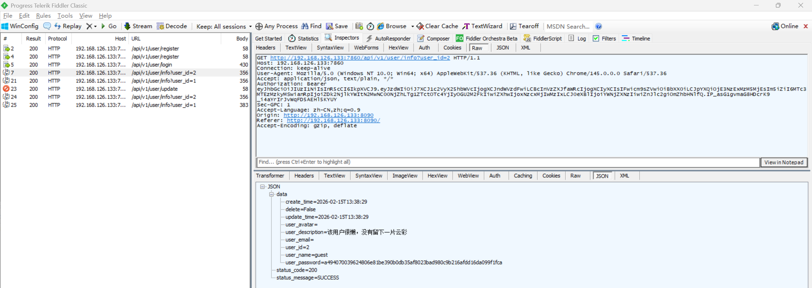
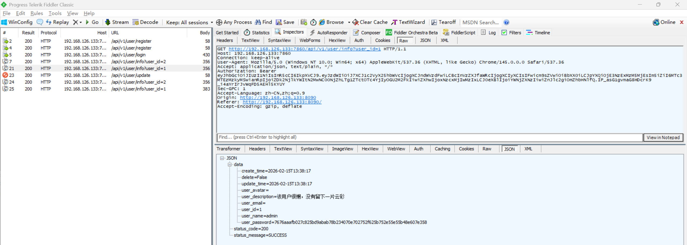

# Insecure Direct Object Reference Vulnerability in AgentChat

> **Software and Affected Version:** [AgentChat](https://github.com/Shy2593666979/AgentChat) ≤ v2.3.0

## Affected Files

-   `/src/backend/agentchat/api/v1/user.py`

## Description

An Insecure Direct Object Reference (IDOR) vulnerability exists in [AgentChat](https://github.com/Shy2593666979/AgentChat) ≤ v2.3.0 at the `/api/v1/user/info` endpoint, where the `user_id` parameter is accepted directly from user input without proper authorization checks. As a result, unauthenticated attackers can access arbitrary users' information by manipulating the `user_id` parameter, leading to unauthorized disclosure of sensitive user data. Mitigations include implementing proper authorization checks to ensure users can only access their own information, retrieving the user ID from the authenticated session/token rather than accepting it as a parameter, applying role-based access control (RBAC) to restrict access to user data, and logging all user information access attempts for security auditing.

## Code Analysis

In `/src/backend/agentchat/api/v1/user.py`:

```py
@router.get("/user/info", response_model=UnifiedResponseModel)
async def get_user_info(user_id: str):
    result = UserService.get_user_info_by_id(user_id)
    return resp_200(result)
```

The user ID is passed as a request parameter, rather than being obtained through a token, and can be modified arbitrarily.

## Proof of Concept

Create user admin:


Create user guest:


Login as guest:


Query information of guest as guest (should allow):



Query information of admin as guest (should deny):


