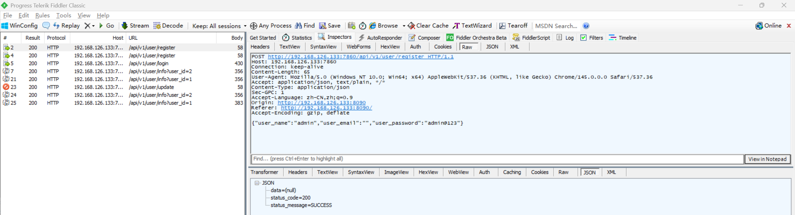
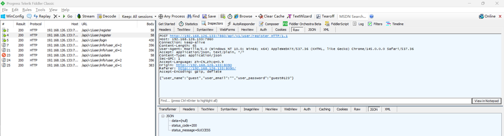
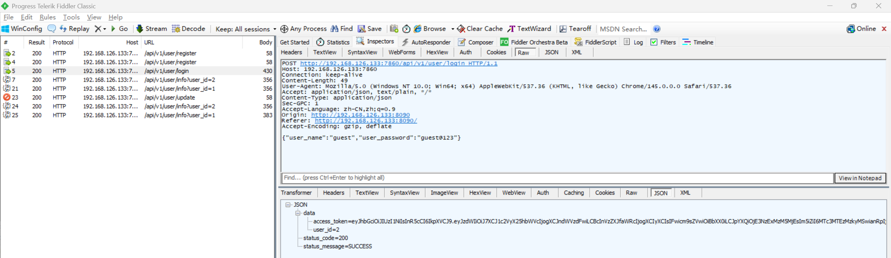
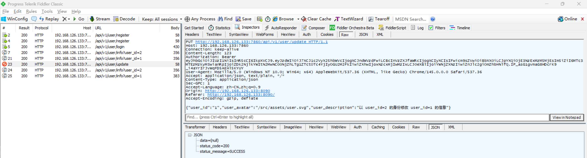
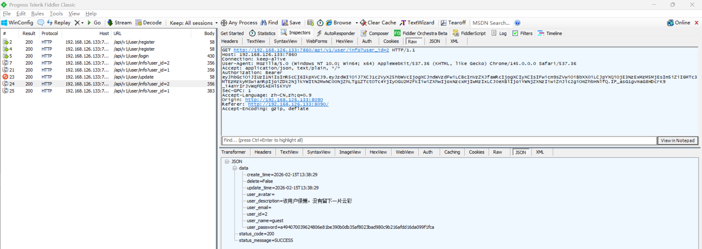
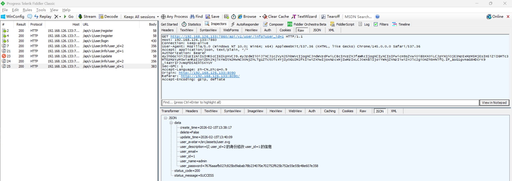

# Insecure Direct Object Reference Vulnerability in AgentChat

> **Software and Affected Version:** [AgentChat](https://github.com/Shy2593666979/AgentChat) ≤ v2.3.0

## Vulnerability Files

-   `/src/backend/agentchat/api/v1/user.py`

## Description

An Insecure Direct Object Reference (IDOR) vulnerability exists in [AgentChat](https://github.com/Shy2593666979/AgentChat) ≤ v2.3.0 at the `/api/v1/user/update` endpoint, where the `user_id` parameter is accepted directly from user input without proper authorization checks. As a result, unauthenticated attackers can modify arbitrary users' information by manipulating the `user_id` parameter, leading to unauthorized modification of other users' profiles including avatars and descriptions. Mitigations include implementing proper authorization checks to ensure users can only update their own information, retrieving the user ID from the authenticated session/token rather than accepting it as a parameter, applying role-based access control (RBAC) to restrict update operations, and logging all user information modification attempts for security auditing.

## Code Analysis

In `/src/backend/agentchat/api/v1/user.py`:

```py
@router.put("/user/update", response_model=UnifiedResponseModel)
async def update_user_info(user_id: str = Body(description="用户的ID"),
                           user_avatar: Optional[str] = Body(description="用户的头像地址"),
                           user_description: Optional[str] = Body(description="用户的描述")):
    UserService.update_user_info(user_id, user_avatar, user_description)
    return resp_200()
```

The user ID is passed in as a request parameter, rather than being obtained through a token, and can be modified arbitrarily.

## Proof of Concept

Create user admin:



Create user guest:



Login as guest:



Update admin's information:



Query information of guest, remains unchanged:



Query information of admin, illegally modified:


