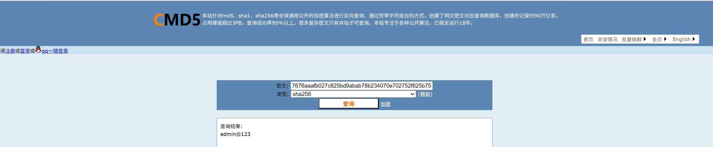

# Information Disclosure Vulnerability in AgentChat

> **Software and Affected Version:** [AgentChat](https://github.com/Shy2593666979/AgentChat) ≤ v2.3.0

## Vulnerability Files

-   `/src/backend/agentchat/api/v1/user.py`
-   `/src/backend/agentchat/api/services/user.py`
-   `/src/backend/agentchat/database/dao/user.py`

## Description

An information disclosure vulnerability exists in [AgentChat](https://github.com/Shy2593666979/AgentChat) ≤ v2.3.0 at the `/api/v1/user/info` endpoint, where the user query functionality returns all database fields without proper filtering, including sensitive information such as SHA256 password hashes without salt. As a result, unauthenticated attackers can obtain password hashes of any user by simply enumerating user IDs, then reverse them using rainbow table attacks or online hash cracking services, significantly compromising user account security. Mitigations include implementing proper field filtering to exclude sensitive data from API responses, using salted password hashing algorithms (e.g., bcrypt), and applying proper authentication and authorization checks to restrict access to user information.

## Code Analysis

In `/src/backend/agentchat/api/v1/user.py`:

```py
@router.get("/user/info", response_model=UnifiedResponseModel)
async def get_user_info(user_id: str):
    result = UserService.get_user_info_by_id(user_id)
    return resp_200(result)
```

In `/src/backend/agentchat/api/services/user.py`:

```py
class UserService:

    # ...

    @classmethod
    def get_user_info_by_id(cls, user_id):
        user_info = UserDao.get_user(user_id)
        return user_info.to_dict()
```

In `/src/backend/agentchat/database/dao/user.py`:

```py
class UserDao:

    # ...

    @classmethod
    def get_user(cls, user_id: str) -> UserTable | None:
        with session_getter() as session:
            statement = select(UserTable).where(UserTable.user_id == user_id)
            return session.exec(statement).first()
```

When querying user information, no fields are filtered, resulting in sensitive fields such as passwords being returned to the client.

## Proof of Concept

Query user information by id using [the IDOR vulnerability](https://github.com/CC-T-454455/Vulnerabilities/tree/master/agent-chat/vulnerability-1):


The returned password is the SHA256 of the original password, without salt, and can be reverse-engineered using [cmd5](https://cmd5.com/).


