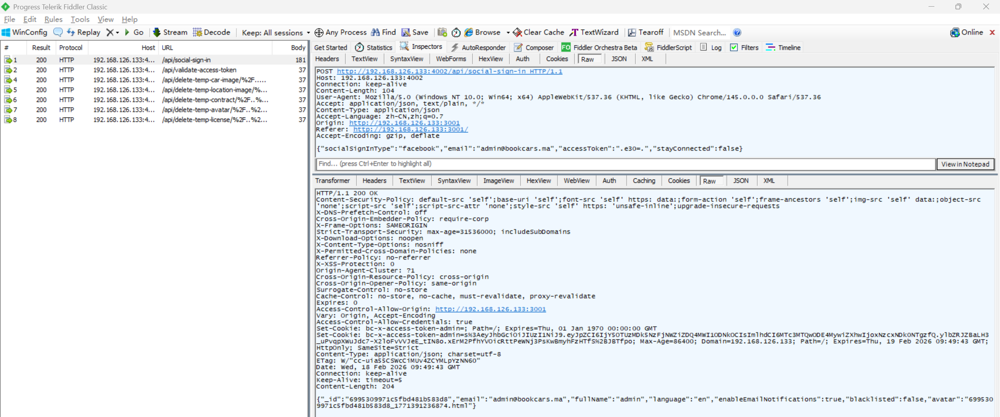
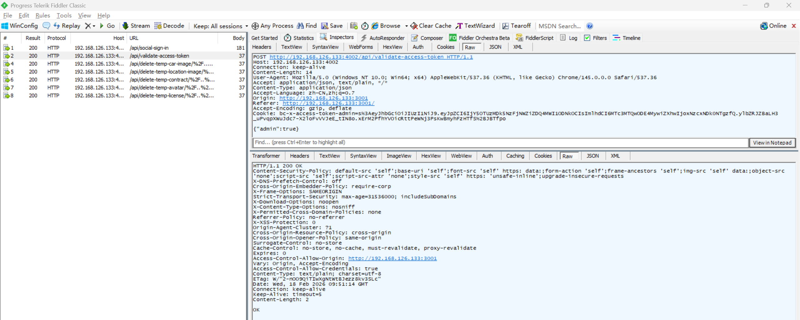

# Insecure Authentication Vulnerability in BookCars

> **Software and Affected Version:** [BookCars](https://github.com/aelassas/bookcars) ≤ v8.3

## Affected Files

-   `/backend/src/routes/userRoutes.ts`
-   `/backend/src/controllers/userController.ts`
-   `/backend/src/utils/authHelper.ts`

## Description

An insecure authentication vulnerability exists in [BookCars](https://github.com/aelassas/bookcars) ≤ v8.3 at the `/api/social-sign-in` endpoint, where JWT access tokens from social sign-in providers are improperly validated. As a result, unauthenticated attackers can forge arbitrary JWT tokens and authenticate as any user by simply base64-encoding a JSON payload. This enables complete account takeover of any user account through social sign-in flows (Facebook, Apple, etc.) without requiring valid credentials or access tokens from legitimate OAuth providers. Mitigations include implementing proper JWT signature verification using the provider's public keys, validating tokens against the social provider's token validation endpoints, implementing token expiration checks, and adding rate limiting to prevent brute force attacks on the authentication endpoint.

## Code Analysis

In `/backend/src/routes/userRoutes.ts`:

```ts
routes.route(routeNames.socialSignin).post(userController.socialSignin);
// routeNames.socialSignin: '/api/social-sign-in'
```

In `/backend/src/controllers/userController.ts`:

```ts
/**
 * Sign In.
 *
 * @export
 * @async
 * @param {Request} req
 * @param {Response} res
 * @returns {unknown}
 */
export const socialSignin = async (req: Request, res: Response) => {
    const { body }: { body: bookcarsTypes.SignInPayload } = req;
    const { socialSignInType, accessToken, email: emailFromBody, fullName, avatar, stayConnected, mobile } = body;

    try {
        if (!socialSignInType) {
            throw new Error('body.socialSignInType not found');
        }

        if (!emailFromBody) {
            throw new Error('body.email not found');
        }

        const email = helper.trim(emailFromBody, ' ');

        if (!helper.isValidEmail(email)) {
            throw new Error('body.email is not valid');
        }

        if (!mobile) {
            if (!accessToken) {
                throw new Error('body.accessToken not found');
            }

            if (!(await authHelper.validateAccessToken(socialSignInType, accessToken, email))) {
                throw new Error('body.accessToken is not valid');
            }
        }

        let user = await User.findOne({ email });

        // ...

        res.clearCookie(cookieName).cookie(cookieName, token, cookieOptions).status(200).send(loggedUser);
    } catch (err) {
        logger.error(`[user.socialSignin] ${i18n.t('DB_ERROR')} ${emailFromBody}`, err);
        res.status(400).send(i18n.t('DB_ERROR') + err);
    }
};
```

In `/backend/src/utils/authHelper.ts`:

```ts
/**
 * Parse JWT token.
 *
 * @param {string} token
 * @returns {any}
 */
export const parseJwt = (token: string) => JSON.parse(Buffer.from(token.split('.')[1], 'base64').toString());

/**
 * Validate JWT token structure.
 *
 * @param {string} token
 * @returns {Promise<boolean>}
 */
export const validateAccessToken = async (
    socialSignInType: bookcarsTypes.SocialSignInType,
    token: string,
    email: string
): Promise<boolean> => {
    if (socialSignInType === bookcarsTypes.SocialSignInType.Facebook) {
        try {
            parseJwt(token);
            return true;
        } catch {
            return false;
        }
    }

    if (socialSignInType === bookcarsTypes.SocialSignInType.Apple) {
        try {
            const res = parseJwt(token);
            return res.email === email;
        } catch {
            return false;
        }
    }

    // ...

    return false;
};
```

The `validateAccessToken` function fails to perform cryptographic signature verification on JWT tokens. For Facebook authentication, it only attempts to parse the token structure, and for Apple authentication, it merely checks if the decoded email matches the provided email. The `parseJwt` function simply base64-decodes the JWT payload without verifying the token's signature against the provider's public key, making it trivial for attackers to craft valid-looking tokens.

## Proof of Concept

Login as user `admin@bookcars.ma` using the following request without password:



Verify that `admin@bookcars.ma` logged in successfully:


