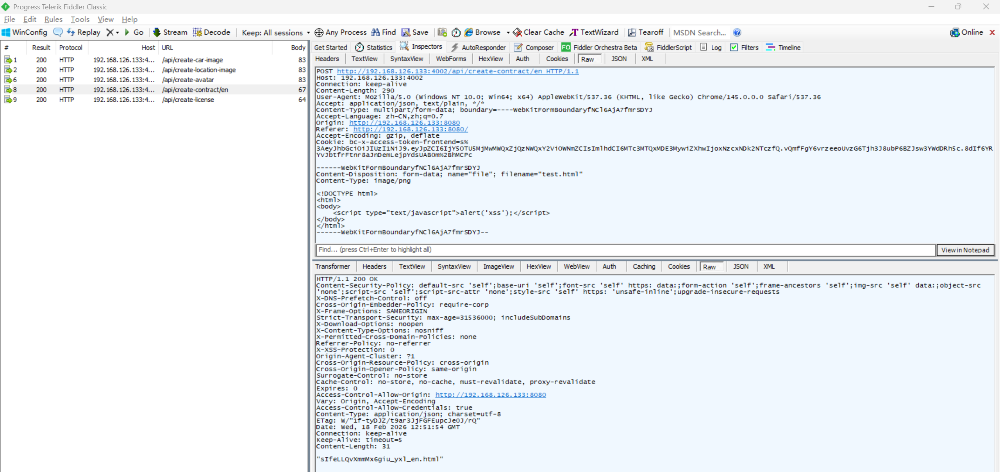
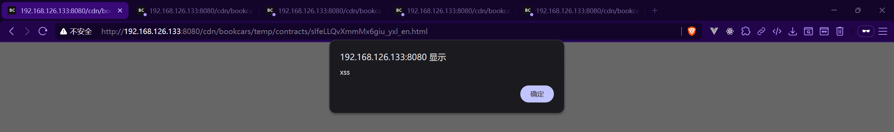

# Unrestricted File Upload Vulnerability in BookCars

> **Software and Affected Version:** [BookCars](https://github.com/aelassas/bookcars) ≤ v8.3

## Vulnerability Files

-   `/backend/src/routes/supplierRoutes.ts`
-   `/backend/src/controllers/supplierController.ts`

## Description

An unrestricted file upload vulnerability exists in [BookCars](https://github.com/aelassas/bookcars) ≤ v8.3 at the `/api/create-contract/{language}` endpoint, where uploaded files are stored in the CDN temporary directory without proper file type validation or content verification. The application only generates a safe filename but fails to validate the file extension or verify the actual content type of uploaded files. As a result, authenticated attackers can upload arbitrary file types (e.g., HTML) containing malicious JavaScript, which will be executed when accessed through the CDN directory, leading to stored Cross-Site Scripting (XSS) attacks. Mitigations include implementing a strict whitelist of allowed file extensions, validating file content using magic bytes verification, enforcing proper Content-Type and Content-Disposition headers when serving uploaded files, applying CSP policies to CDN directories, and sanitizing or rejecting files that may contain executable code.

## Code Analysis

In `/backend/src/routes/supplierRoutes.ts`:

```ts
routes.route(routeNames.createContract).post([authJwt.verifyToken, multer({ storage: multer.memoryStorage() }).single('file')], supplierController.createContract);
// routeNames.createContract: '/api/create-contract/:language'
```

In `/backend/src/controllers/supplierController.ts`:

```ts
/**
 * Upload a contract to temp folder.
 *
 * @export
 * @async
 * @param {Request} req
 * @param {Response} res
 * @returns {unknown}
 */
export const createContract = async (req: Request, res: Response) => {
    const { language } = req.params;

    try {
        if (!req.file) {
            throw new Error('req.file not found');
        }
        if (!req.file.originalname.includes('.')) {
            throw new Error('File extension not found');
        }
        if (language.length !== 2) {
            throw new Error('Language not valid');
        }

        const filename = `${nanoid()}_${language}${path.extname(req.file.originalname)}`;
        const filepath = path.join(env.CDN_TEMP_CONTRACTS, filename);

        await asyncFs.writeFile(filepath, req.file.buffer);
        res.json(filename);
    } catch (err) {
        logger.error(`[supplier.createContract] ${i18n.t('DB_ERROR')}`, err);
        res.status(400).send(i18n.t('ERROR') + err);
    }
};
```

There are no restrictions on file extensions or validation of file content, allowing attackers to upload files with dangerous extensions such as `.html`, `.svg`, or `.xhtml`.

## Proof of Concept

Upload an HTML file containing malicious JavaScript using the following request:



When accessing the CDN directory through the frontend, malicious JavaScript is executed (CSP policies only apply to CDN directories hosted on the backend server, not to CDN directories hosted on the frontend server):


