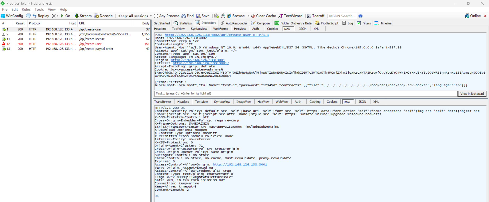
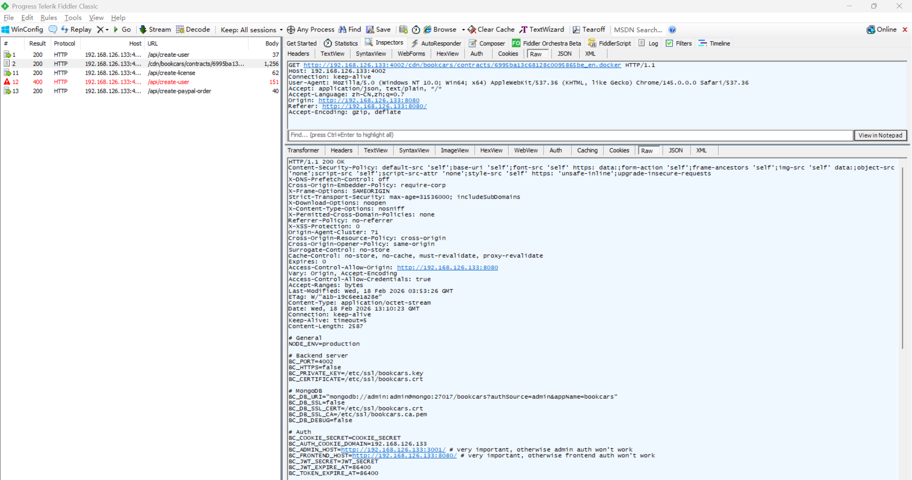
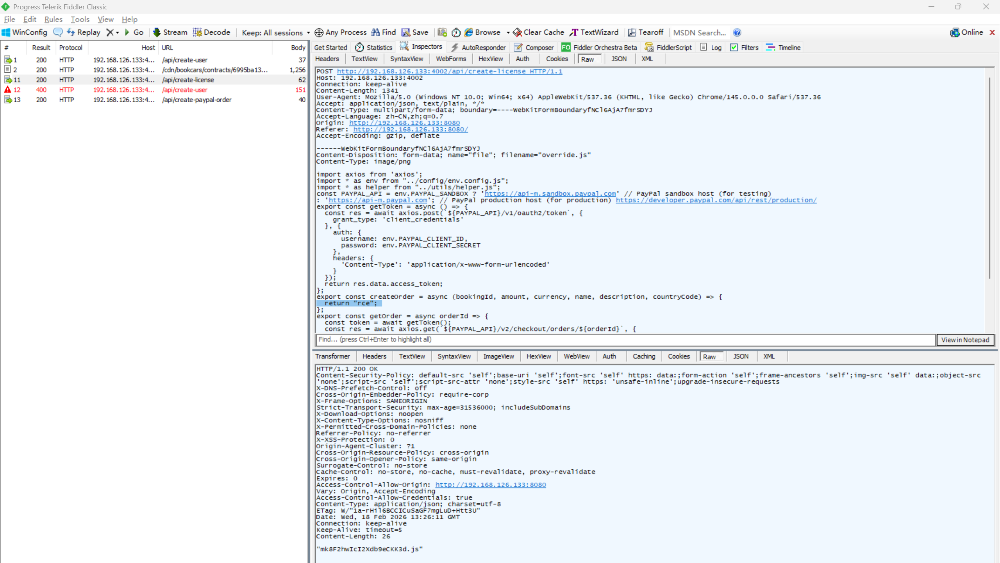
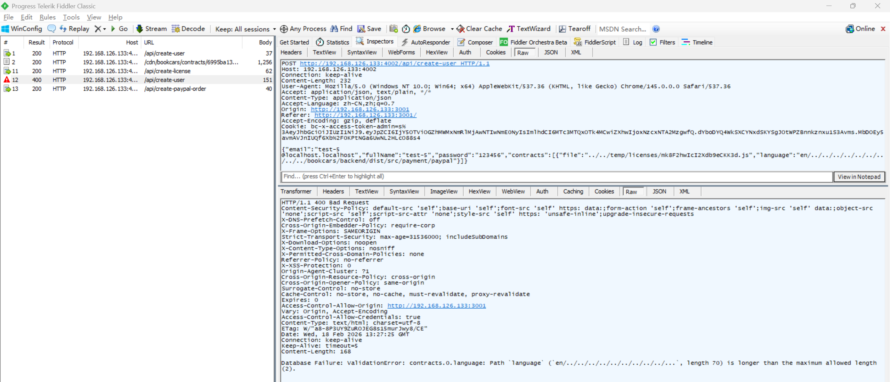
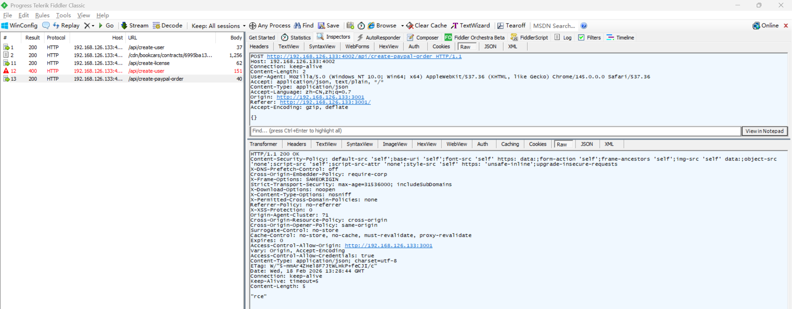

# Unrestricted File Rename Vulnerability Leading to RCE in BookCars

> **Software and Affected Version:** [BookCars](https://github.com/aelassas/bookcars) ≤ v8.3

## Vulnerability Files

-   `/backend/src/routes/userRoutes.ts`
-   `/backend/src/controllers/userController.ts`

## Description

An unrestricted file rename vulnerability exists in [BookCars](https://github.com/aelassas/bookcars) ≤ v8.3 at the `/api/create-user` endpoint, where the `file` and `language` fields from the user-supplied `contracts` array in the request body are directly concatenated into filesystem paths during file renaming operations without validation or canonicalization. As a result, authenticated attackers can leverage directory traversal sequences to move arbitrary files from temporary storage to arbitrary locations on the server filesystem. This enables unauthorized access to sensitive files, the overwriting of critical application files, and potentially achieving remote code execution by replacing dynamically imported JavaScript modules. Mitigations include validating and sanitizing both source and destination path components, canonicalizing paths and verifying they remain within designated directories, rejecting inputs containing directory traversal sequences or absolute paths, using server-side generated filenames, implementing strict file extension whitelisting, and enforcing least-privilege filesystem permissions.

**Note:** This vulnerability relies on the `fs.rename()` operation, which requires source and destination paths to be on the same filesystem device. In non-docker deployments or docker deployments without separate volume mounts for the CDN directory, the exploit works as described. However, if the CDN directory is mounted as a separate volume, the rename operation will fail when attempting to move files across different mount points.

## Code Analysis

In `/backend/src/routes/userRoutes.ts`:

```ts
routes.route(routeNames.create).post(authJwt.verifyToken, userController.create);
// routeNames.create: '/api/create-user'
```

In `/backend/src/controllers/userController.ts`:

```ts
/**
 * Create a User.
 *
 * @export
 * @async
 * @param {Request} req
 * @param {Response} res
 * @returns {unknown}
 */
export const create = async (req: Request, res: Response) => {
    const { body }: { body: bookcarsTypes.CreateUserPayload } = req;

    try {
        body.verified = false;
        body.blacklisted = false;

        if (body.password) {
            const { password } = body;
            const passwordHash = await authHelper.hashPassword(password);
            body.password = passwordHash;
        }

        const { contracts } = body;
        body.contracts = undefined;

        const user = new User(body);
        await user.save();

        const finalContracts: bookcarsTypes.Contract[] = [];
        if (contracts) {
            for (const contract of contracts) {
                if (contract.language && contract.file) {
                    const tempFile = path.join(env.CDN_TEMP_CONTRACTS, contract.file);

                    if (await helper.pathExists(tempFile)) {
                        const filename = `${user._id.toString()}_${contract.language}${path.extname(tempFile)}`;
                        const newPath = path.join(env.CDN_CONTRACTS, filename);

                        await asyncFs.rename(tempFile, newPath);
                        finalContracts.push({ language: contract.language, file: filename });
                    }
                }
            }
            user.contracts = finalContracts;
            await user.save();
        }

        // ...
    } catch (err) {
        logger.error(`[user.create] ${i18n.t('DB_ERROR')} ${JSON.stringify(body)}`, err);
        res.status(400).send(i18n.t('DB_ERROR') + err);
    }
};
```

The vulnerability occurs in the file renaming logic where both the source path (`tempFile`) and destination path (`newPath`) are constructed using unsanitized user input. The `contract.file` parameter is directly concatenated into the source path, allowing attackers to traverse outside `CDN_TEMP_CONTRACTS` to reference arbitrary files. Similarly, `contract.language` is concatenated into the destination filename, enabling directory traversal in the target path to write files outside `CDN_CONTRACTS`.

## Proof of Concept

Move sensitive configuration files to the static resource directory using the following request:



Read sensitive configurations from the static resource directory:



Upload malicious JavaScript files to the static resource directory using [unrestricted file upload vulnerability](https://github.com/CC-T-454455/Vulnerabilities/tree/master/bookcars/vulnerability-16):



Move a malicious JavaScript file to overwrite an existing JavaScript file:



Because paypal.js is dynamically imported at runtime, this will result in remote code execution:

```ts
/**
 * Create PayPal order.
 *
 * @async
 * @param {Request} req
 * @param {Response} res
 * @returns {unknown}
 */
export const createPayPalOrder = async (req: Request, res: Response) => {
    try {
        const paypal = await import('../payment/paypal.js');
        const { bookingId, amount, currency, name, description }: bookcarsTypes.CreatePayPalOrderPayload = req.body;

        const clientIp = ipinfoHelper.getClientIp(req);
        const countryCode = await ipinfoHelper.getCountryCode(clientIp);

        const orderId = await paypal.createOrder(bookingId, amount, currency, name, description, countryCode);

        res.json(orderId);
    } catch (err) {
        logger.error(`[paypal.createPayPalOrder] ${i18n.t('ERROR')}`, err);
        res.status(400).send(i18n.t('ERROR') + err);
    }
};
```


