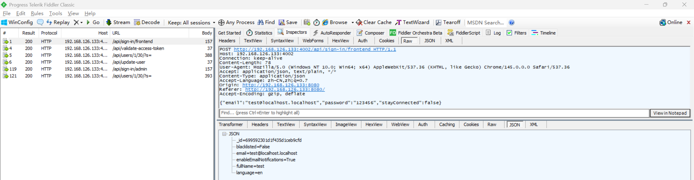
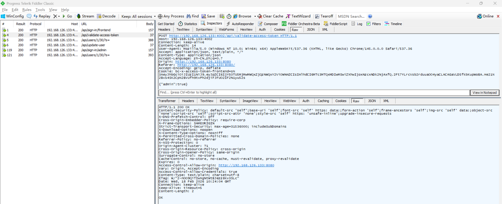
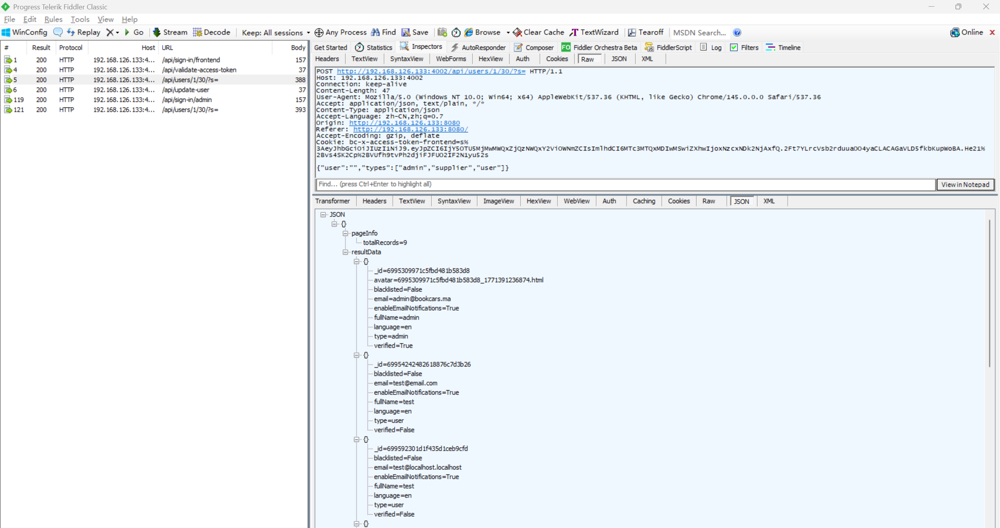

# Authorization Bypass Vulnerability in BookCars

> **Software and Affected Version:** [BookCars](https://github.com/aelassas/bookcars) ≤ v8.3

## Vulnerability Files

-   `/backend/src/routes/userRoutes.ts`
-   `/backend/src/middlewares/authJwt.ts`
-   `/backend/src/utils/authHelper.ts`

## Description

An authorization bypass vulnerability exists in [BookCars](https://github.com/aelassas/bookcars) ≤ v8.3 at the authorization functionality, where the authentication middleware incorrectly uses the `Origin` header to determine which user role is required to access an endpoint. As a result, authenticated attackers can bypass authorization checks by spoofing the `Origin` header to match the user frontend host value, causing the server to incorrectly apply regular user permission checks to admin-only endpoints such as `/api/users`, thereby gaining unauthorized access to sensitive administrative functions. Mitigations include implementing proper role-based access control (RBAC) by explicitly defining required roles at the endpoint level rather than inferring them from client-controlled headers, and validating the authenticated user's actual role from the database against the endpoint's required permissions.

## Code Analysis

In `/backend/src/routes/userRoutes.ts`:

```ts
routes.route(routeNames.getPushToken).get(authJwt.verifyToken, userController.getPushToken);
routes.route(routeNames.createPushToken).post(authJwt.verifyToken, userController.createPushToken);
routes.route(routeNames.deletePushToken).post(authJwt.verifyToken, userController.deletePushToken);
routes.route(routeNames.validateAccessToken).post(authJwt.verifyToken, userController.validateAccessToken);
routes.route(routeNames.resendLink).post(authJwt.verifyToken, userController.resendLink);
routes.route(routeNames.update).post(authJwt.verifyToken, userController.update);
routes.route(routeNames.updateEmailNotifications).post(authJwt.verifyToken, userController.updateEmailNotifications);
routes.route(routeNames.updateLanguage).post(authJwt.verifyToken, userController.updateLanguage);
routes.route(routeNames.getUser).get(authJwt.verifyToken, userController.getUser);
routes.route(routeNames.deleteAvatar).post(authJwt.verifyToken, userController.deleteAvatar);
routes.route(routeNames.deleteTempAvatar).post(authJwt.verifyToken, userController.deleteTempAvatar);
routes.route(routeNames.changePassword).post(authJwt.verifyToken, userController.changePassword);
routes.route(routeNames.checkPassword).get(authJwt.verifyToken, userController.checkPassword);
routes.route(routeNames.getUsers).post(authJwt.verifyToken, userController.getUsers);
routes.route(routeNames.delete).post(authJwt.verifyToken, userController.deleteUsers);
routes.route(routeNames.hasPassword).get(authJwt.verifyToken, userController.hasPassword);
routes.route(routeNames.deleteLicense).post(authJwt.verifyToken, userController.deleteLicense);
```

In `/backend/src/middlewares/authJwt.ts`:

```ts
/**
 * Verify authentication token middleware.
 *
 * @param {Request} req
 * @param {Response} res
 * @param {NextFunction} next
 */
const verifyToken = async (req: Request, res: Response, next: NextFunction) => {
    let token: string;
    const isAdmin = authHelper.isAdmin(req);
    const isFrontend = authHelper.isFrontend(req);

    if (isAdmin) {
        token = req.signedCookies[env.ADMIN_AUTH_COOKIE_NAME] as string; // admin
    } else if (isFrontend) {
        token = req.signedCookies[env.FRONTEND_AUTH_COOKIE_NAME] as string; // frontend
    } else {
        token = req.headers[env.X_ACCESS_TOKEN] as string; // mobile app and unit tests
    }

    if (token) {
        // Check token
        try {
            const sessionData = await authHelper.decryptJWT(token);
            const $match: mongoose.QueryFilter<env.User> = {
                $and: [
                    { _id: new mongoose.Types.ObjectId(sessionData?.id) }
                    // { blacklisted: false },
                ]
            };

            if (isAdmin) {
                $match.$and?.push({ type: { $in: [bookcarsTypes.UserType.Admin, bookcarsTypes.UserType.Supplier] } });
            } else if (isFrontend) {
                $match.$and?.push({ type: bookcarsTypes.UserType.User });
            }

            if (!sessionData || !helper.isValidObjectId(sessionData.id) || !(await User.exists($match))) {
                // Token not valid!
                logger.info('Token not valid: User not found');
                res.status(401).send({ message: 'Unauthorized!' });
            } else {
                // Token valid!
                next();
            }
        } catch (err) {
            // Token not valid!
            logger.info('Token not valid', err);
            res.status(401).send({ message: 'Unauthorized!' });
        }
    } else {
        // Token not found!
        res.status(403).send({ message: 'No token provided!' });
    }
};
```

In `/backend/src/utils/authHelper.ts`:

```ts
/**
 * Check whether the request is from the admin or not.
 *
 * @export
 * @param {Request} req
 * @returns {boolean}
 */
export const isAdmin = (req: Request): boolean =>
    !!req.headers.origin && helper.trimEnd(req.headers.origin, '/') === helper.trimEnd(env.ADMIN_HOST, '/');

/**
 * Check whether the request is from the frontend or not.
 *
 * @export
 * @param {Request} req
 * @returns {boolean}
 */
export const isFrontend = (req: Request): boolean =>
    !!req.headers.origin && helper.trimEnd(req.headers.origin, '/') === helper.trimEnd(env.FRONTEND_HOST, '/');
```

The authentication middleware incorrectly uses the `Origin` header to determine what level of permissions an endpoint requires. When `isAdmin` is true (based on the spoofed Origin header), the middleware checks if the user has admin privileges in the database. When `isFrontend` is true, it only checks if the user is a regular user. This allows a regular user to manipulate the `Origin` header to make the server believe the endpoint only requires regular user permissions, bypassing the intended admin-only access restrictions.

## Proof of Concept

Login as user `test@localhost.localhost` using the following request:



Verify that `test@localhost.localhost` logged in successfully:



Users are enumerated via `/api/users`, this API is only called from the admin frontend, but `test@localhost.localhost` without admin permission can forge the origin of user frontend, causing the server to mistakenly believe that this API can be called by non-admin users:


