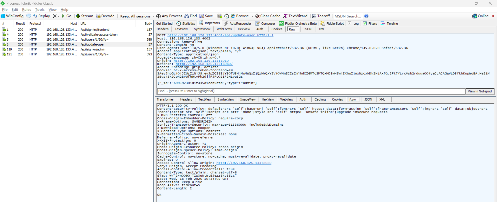
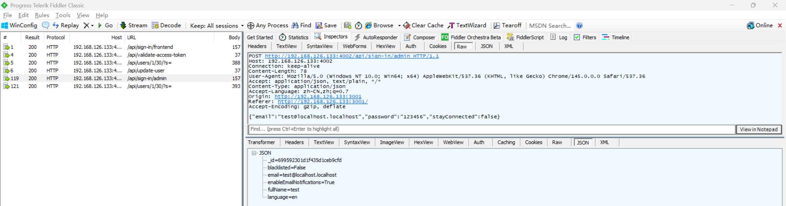
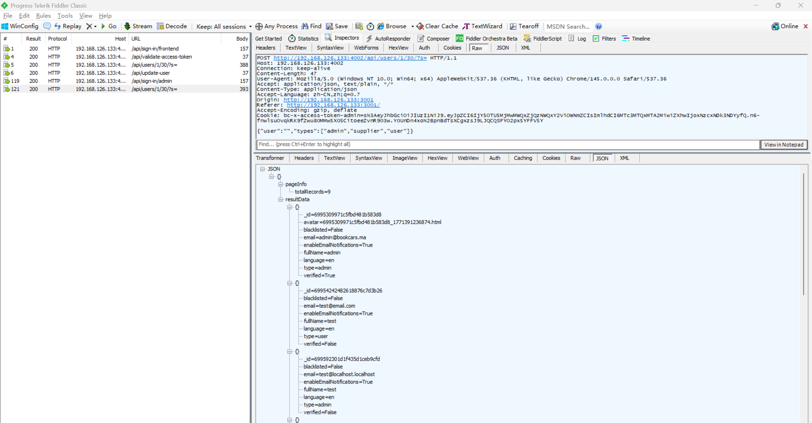

# Privilege Escalation Vulnerability in BookCars

> **Software and Affected Version:** [BookCars](https://github.com/aelassas/bookcars) ≤ v8.3

## Affected Files

-   `/backend/src/routes/userRoutes.ts`
-   `/backend/src/controllers/userController.ts`

## Description

A privilege escalation vulnerability exists in [BookCars](https://github.com/aelassas/bookcars) ≤ v8.3 at the `/api/update-user` endpoint, where authenticated users can arbitrarily modify their own user type without proper authorization checks. The vulnerability stems from accepting the `type` parameter directly from user input and applying it without validating whether the requesting user has sufficient privileges to perform such modifications. As a result, authenticated attackers can escalate their privileges from `user` to `admin`, leading to complete compromise of the application's access control system. Mitigations include implementing proper authorization checks to ensure only administrators can modify user types, removing the ability for users to update their own roles through the self-service update endpoint, applying role-based access control (RBAC) to restrict privileged operations, and logging all user type modification attempts for security auditing.

## Code Analysis

In `/backend/src/routes/userRoutes.ts`:

```ts
routes.route(routeNames.update).post(authJwt.verifyToken, userController.update);
// routeNames.update: '/api/update-user'
```

In `/backend/src/controllers/userController.ts`:

```ts
/**
 * Update User.
 *
 * @export
 * @async
 * @param {Request} req
 * @param {Response} res
 * @returns {unknown}
 */
export const update = async (req: Request, res: Response) => {
    try {
        const { body }: { body: bookcarsTypes.UpdateUserPayload } = req;
        const { _id } = body;

        if (!helper.isValidObjectId(_id)) {
            throw new Error('User id is not valid');
        }

        const user = await User.findById(_id);

        if (!user) {
            logger.error('[user.update] User not found:', body.email);
            res.sendStatus(204);
            return;
        }

        const {
            fullName,
            phone,
            bio,
            location,
            type,
            birthDate,
            enableEmailNotifications,
            payLater,
            licenseRequired,
            minimumRentalDays,
            priceChangeRate,
            supplierCarLimit,
            notifyAdminOnNewCar,
            blacklisted
        } = body;

        if (fullName) {
            user.fullName = fullName;
        }
        user.phone = phone;
        user.location = location;
        user.bio = bio;
        user.birthDate = birthDate ? new Date(birthDate) : undefined;
        user.minimumRentalDays = minimumRentalDays;
        user.priceChangeRate = priceChangeRate;
        user.supplierCarLimit = supplierCarLimit;
        user.notifyAdminOnNewCar = notifyAdminOnNewCar;
        user.blacklisted = !!blacklisted;
        if (type) {
            user.type = type as bookcarsTypes.UserType;
        }
        if (typeof enableEmailNotifications !== 'undefined') {
            user.enableEmailNotifications = enableEmailNotifications;
        }
        if (typeof payLater !== 'undefined') {
            user.payLater = payLater;
        }
        if (typeof licenseRequired !== 'undefined') {
            user.licenseRequired = licenseRequired;
        }

        await user.save();
        res.sendStatus(200);
    } catch (err) {
        logger.error(`[user.update] ${i18n.t('DB_ERROR')} ${JSON.stringify(req.body)}`, err);
        res.status(400).send(i18n.t('DB_ERROR') + err);
    }
};
```

Non-administrator users should be prohibited from modifying their own roles, but this restriction is not implemented in the code.

## Proof of Concept

Login as user `test@localhost.localhost` on the user frontend using the following request:


Verify that `test@localhost.localhost` logged in successfully:


Query users using this [authorization bypass vulnerability](https://github.com/CC-T-454455/Vulnerabilities/tree/master/bookcars/vulnerability-2), user `test@localhost.localhost` has type set to `user`:


Update type of user `test@localhost.localhost` to `admin` by its id:



Login as user `test@localhost.localhost` on the admin frontend using the following request:



The type of `test@localhost.localhost` has been changed to `admin`:


