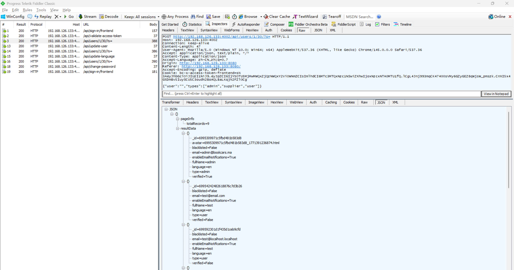
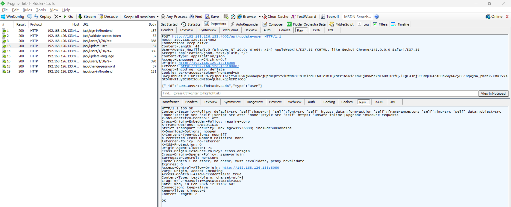

# Insecure Direct Object Reference Vulnerability in BookCars

> **Software and Affected Version:** [BookCars](https://github.com/aelassas/bookcars) ≤ v8.3

## Vulnerability Files

-   `/backend/src/routes/userRoutes.ts`
-   `/backend/src/controllers/userController.ts`

## Description

An Insecure Direct Object Reference (IDOR) vulnerability exists in [BookCars](https://github.com/aelassas/bookcars) ≤ v8.3 at the `/api/update-user` endpoint, where the `_id` parameter is accepted directly from user input without proper authorization checks. As a result, authenticated attackers can modify arbitrary users' information by manipulating the `_id` parameter, including full name, phone, bio, location, and critical settings such as user type. Mitigations include implementing proper authorization checks to ensure users can only update their own information, retrieving the user ID from the authenticated session/token rather than accepting it as a parameter, applying role-based access control (RBAC) to restrict update operations based on user roles, and logging all user information modification attempts for security auditing.

## Code Analysis

In `/backend/src/routes/userRoutes.ts`:

```ts
routes.route(routeNames.update).post(authJwt.verifyToken, userController.update);
// routeNames.update: '/api/update-user'
```

In `/backend/src/controllers/userController.ts`:

```ts
/**
 * Update User.
 *
 * @export
 * @async
 * @param {Request} req
 * @param {Response} res
 * @returns {unknown}
 */
export const update = async (req: Request, res: Response) => {
    try {
        const { body }: { body: bookcarsTypes.UpdateUserPayload } = req;
        const { _id } = body;

        if (!helper.isValidObjectId(_id)) {
            throw new Error('User id is not valid');
        }

        const user = await User.findById(_id);

        if (!user) {
            logger.error('[user.update] User not found:', body.email);
            res.sendStatus(204);
            return;
        }

        const {
            fullName,
            phone,
            bio,
            location,
            type,
            birthDate,
            enableEmailNotifications,
            payLater,
            licenseRequired,
            minimumRentalDays,
            priceChangeRate,
            supplierCarLimit,
            notifyAdminOnNewCar,
            blacklisted
        } = body;

        if (fullName) {
            user.fullName = fullName;
        }
        user.phone = phone;
        user.location = location;
        user.bio = bio;
        user.birthDate = birthDate ? new Date(birthDate) : undefined;
        user.minimumRentalDays = minimumRentalDays;
        user.priceChangeRate = priceChangeRate;
        user.supplierCarLimit = supplierCarLimit;
        user.notifyAdminOnNewCar = notifyAdminOnNewCar;
        user.blacklisted = !!blacklisted;
        if (type) {
            user.type = type as bookcarsTypes.UserType;
        }
        if (typeof enableEmailNotifications !== 'undefined') {
            user.enableEmailNotifications = enableEmailNotifications;
        }
        if (typeof payLater !== 'undefined') {
            user.payLater = payLater;
        }
        if (typeof licenseRequired !== 'undefined') {
            user.licenseRequired = licenseRequired;
        }

        await user.save();
        res.sendStatus(200);
    } catch (err) {
        logger.error(`[user.update] ${i18n.t('DB_ERROR')} ${JSON.stringify(req.body)}`, err);
        res.status(400).send(i18n.t('DB_ERROR') + err);
    }
};
```

The user ID is passed as a request parameter, rather than being obtained through a token, and can be modified arbitrarily.

## Proof of Concept

Login as user `test@localhost.localhost` using the following request:


Verify that `test@localhost.localhost` logged in successfully:


Query users using [privilege escalation vulnerability](https://github.com/CC-T-454455/Vulnerabilities/tree/master/bookcars/vulnerability-3), user `admin@bookcars.ma` has type set to `admin`:



Update type of user `admin@bookcars.ma` to `user` by its id:



Query users using [privilege escalation vulnerability](https://github.com/CC-T-454455/Vulnerabilities/tree/master/bookcars/vulnerability-3), the type of `admin@bookcars.ma` has been changed to `user`:


