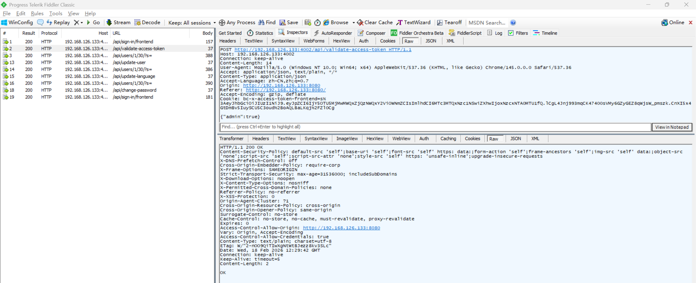
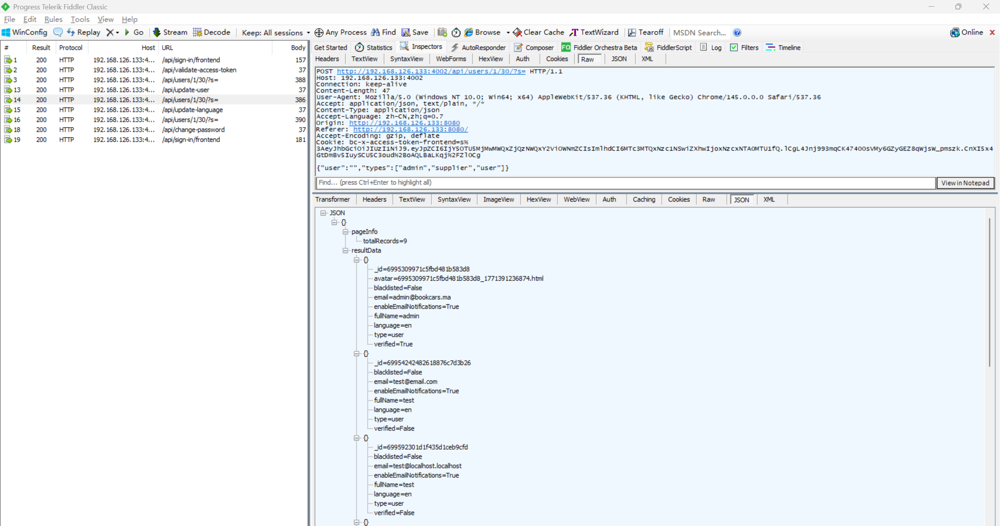
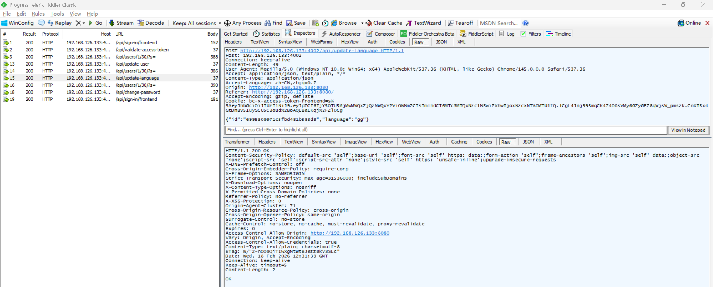

# Insecure Direct Object Reference Vulnerability in BookCars

> **Software and Affected Version:** [BookCars](https://github.com/aelassas/bookcars) ≤ v8.3

## Vulnerability Files

-   `/backend/src/routes/userRoutes.ts`
-   `/backend/src/controllers/userController.ts`

## Description

An Insecure Direct Object Reference (IDOR) vulnerability exists in [BookCars](https://github.com/aelassas/bookcars) ≤ v8.3 at the `/api/update-language` endpoint, where the `id` parameter is accepted directly from user input without proper authorization checks. As a result, authenticated attackers can modify arbitrary users' language preferences by manipulating the `id` parameter, leading to unauthorized modification of other users' settings. Mitigations include implementing proper authorization checks to ensure users can only update their own information, retrieving the user ID from the authenticated session/token rather than accepting it as a parameter, applying role-based access control (RBAC) to restrict update operations based on user roles, and logging all user information modification attempts for security auditing.

## Code Analysis

In `/backend/src/routes/userRoutes.ts`:

```ts
routes.route(routeNames.updateLanguage).post(authJwt.verifyToken, userController.updateLanguage);
// routeNames.updateLanguage: '/api/update-language'
```

In `/backend/src/controllers/userController.ts`:

```ts
/**
 * Update language.
 *
 * @export
 * @async
 * @param {Request} req
 * @param {Response} res
 * @returns {unknown}
 */
export const updateLanguage = async (req: Request, res: Response) => {
    try {
        const { body }: { body: bookcarsTypes.UpdateLanguagePayload } = req;
        const { id, language } = body;

        if (!helper.isValidObjectId(id)) {
            throw new Error('User id is not valid');
        }

        const user = await User.findById(id);
        if (!user) {
            logger.error('[user.updateLanguage] User not found:', id);
            res.sendStatus(204);
            return;
        }

        user.language = language;
        await user.save();
        res.sendStatus(200);
    } catch (err) {
        logger.error(`[user.updateLanguage] ${i18n.t('DB_ERROR')} ${JSON.stringify(req.body)}`, err);
        res.status(400).send(i18n.t('DB_ERROR') + err);
    }
};
```

The user ID is passed as a request parameter, rather than being obtained through a token, and can be modified arbitrarily.

## Proof of Concept

Login as user `test@localhost.localhost` using the following request:


Verify that `test@localhost.localhost` logged in successfully:



Query users using [privilege escalation vulnerability](https://github.com/CC-T-454455/Vulnerabilities/tree/master/bookcars/vulnerability-3), user `admin@bookcars.ma` has language set to `en`:



Update language of user `admin@bookcars.ma` to `gg` by its id:



Query users using [privilege escalation vulnerability](https://github.com/CC-T-454455/Vulnerabilities/tree/master/bookcars/vulnerability-3), the language of `admin@bookcars.ma` has been changed to `gg`:


