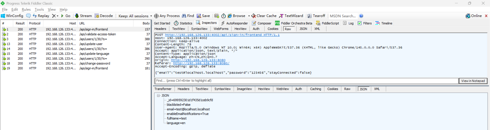
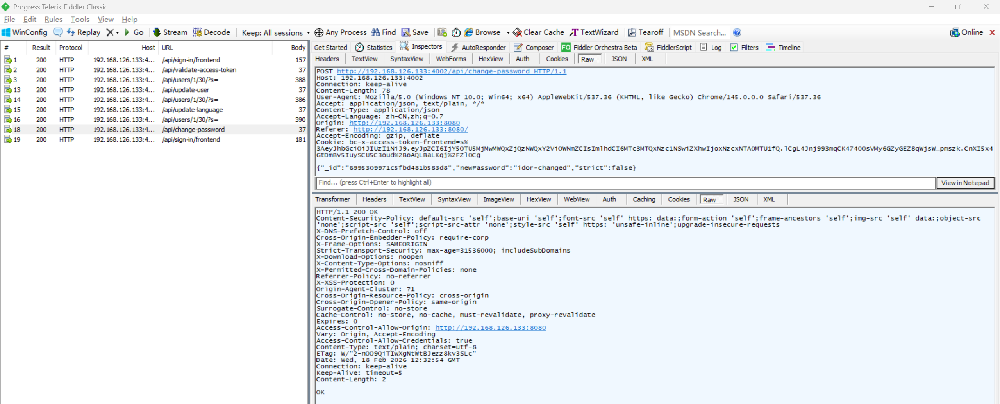
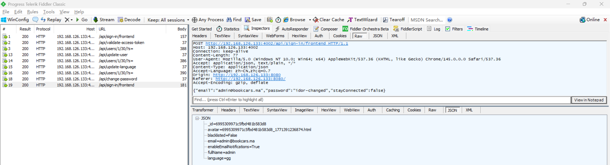

# Insecure Direct Object Reference Vulnerability in BookCars

> **Software and Affected Version:** [BookCars](https://github.com/aelassas/bookcars) ≤ v8.3

## Affected Files

-   `/backend/src/routes/userRoutes.ts`
-   `/backend/src/controllers/userController.ts`

## Description

An Insecure Direct Object Reference (IDOR) vulnerability exists in [BookCars](https://github.com/aelassas/bookcars) ≤ v8.3 at the `/api/change-password` endpoint, where the `_id` parameter is accepted directly from user input without proper authorization checks. As a result, authenticated attackers can modify arbitrary users' passwords by manipulating the `_id` parameter and setting the `strict` field to false to bypass old password verification. This allows unauthorized modification of other users' credentials, including administrator accounts, and leads to complete account takeover. Mitigations include implementing proper authorization checks to ensure users can only change their own passwords, retrieving the user ID from the authenticated session/token rather than accepting it as a parameter, enforcing mandatory old password verification regardless of the `strict` parameter value, and logging all password change attempts for security auditing.

## Code Analysis

In `/backend/src/routes/userRoutes.ts`:

```ts
routes.route(routeNames.changePassword).post(authJwt.verifyToken, userController.changePassword);
// routeNames.changePassword: '/api/change-password'
```

In `/backend/src/controllers/userController.ts`:

```ts
/**
 * Change password.
 *
 * @export
 * @async
 * @param {Request} req
 * @param {Response} res
 * @returns {unknown}
 */
export const changePassword = async (req: Request, res: Response) => {
    const { body }: { body: bookcarsTypes.ChangePasswordPayload } = req;
    const { _id, password: currentPassword, newPassword, strict } = body;

    try {
        if (!helper.isValidObjectId(_id)) {
            throw new Error('User id is not valid');
        }

        const user = await User.findOne({ _id });
        if (!user) {
            logger.error('[user.changePassword] User not found:', _id);
            res.sendStatus(204);
            return;
        }

        if (strict && !user.password) {
            logger.error('[user.changePassword] User.password not found:', _id);
            res.sendStatus(204);
            return;
        }

        const _changePassword = async () => {
            const password = newPassword;
            const passwordHash = await authHelper.hashPassword(password);
            user.password = passwordHash;
            await user.save();
            res.sendStatus(200);
        };

        if (strict) {
            const passwordMatch = await bcrypt.compare(currentPassword, user.password!);
            if (passwordMatch) {
                return _changePassword();
            }

            res.sendStatus(204);
            return;
        }

        return _changePassword();
    } catch (err) {
        logger.error(`[user.changePassword] ${i18n.t('DB_ERROR')} ${_id}`, err);
        res.status(400).send(i18n.t('ERROR') + err);
    }
};
```

The user ID is passed as a request parameter, rather than being obtained through a token, and can be modified arbitrarily.

## Proof of Concept

Login as user `test@localhost.localhost` using the following request:



Verify that `test@localhost.localhost` logged in successfully:


Reset password of user `admin@bookcars.ma` by its id and bypass old password check by setting strict field to false:



User `admin@bookcars.ma` has to login using changed password:


