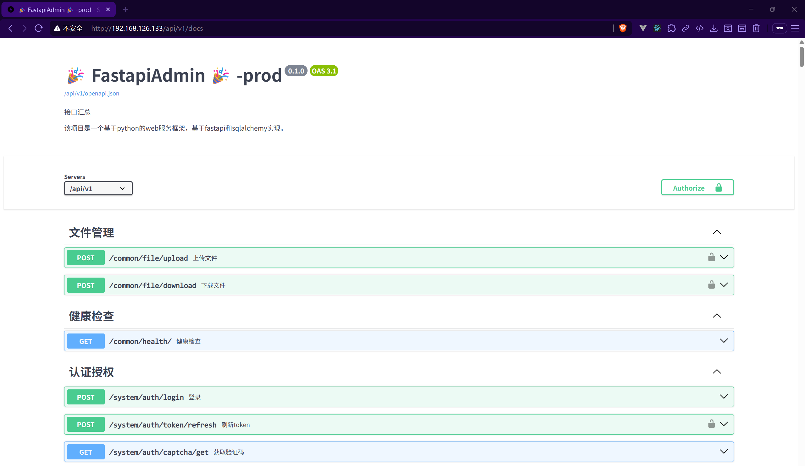
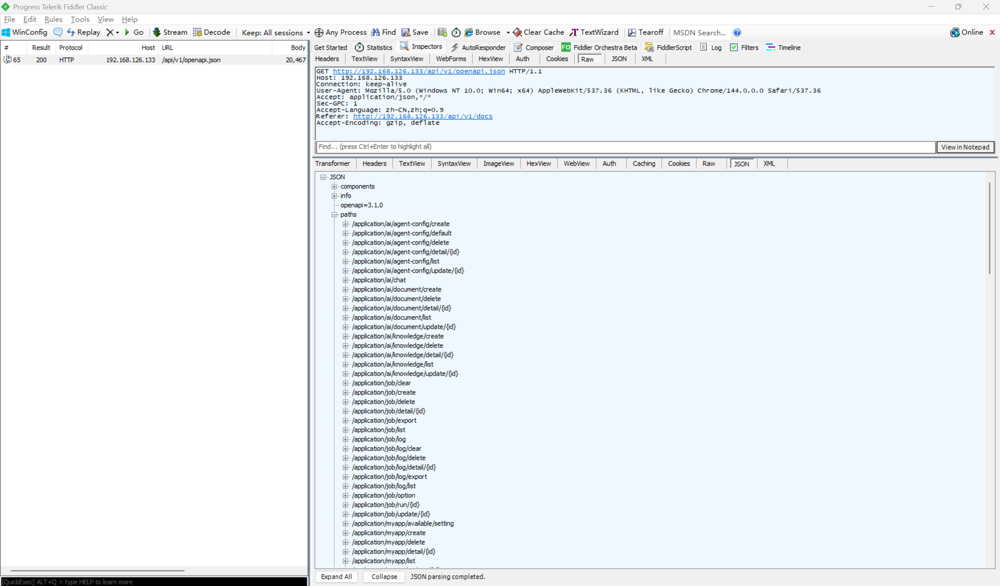

# Information Disclosure Vulnerability in FastapiAdmin

> **Software and Affected Version:** [FastapiAdmin](https://github.com/fastapiadmin/FastapiAdmin) ≤ 2.2.0

## Vulnerability Files

-   `/backend/app/plugin/init_app.py`

## Description

An information disclosure vulnerability exists in [FastapiAdmin](https://github.com/fastapiadmin/FastapiAdmin) ≤ 2.2.0 at the API documentation functionality, where the custom API documentation endpoints are exposed without any authentication or authorization. As a result, unauthenticated attackers can enumerate endpoints, parameters, models and other metadata that can facilitate targeted attacks or leakage of sensitive implementation details. Mitigations include implementing authentication middleware to protect documentation endpoints, restricting documentation access to authorized users only through role-based access control (RBAC), disabling automatic API documentation generation in production environments, using environment-based configuration to conditionally expose documentation only in development/staging environments, and implementing IP whitelisting or VPN-only access for administrative interfaces including API documentation.

## Code Analysis

In `/backend/app/plugin/init_app.py`:

```py
def reset_api_docs(app: FastAPI) -> None:
    """
    使用本地静态资源自定义 API 文档页面（Swagger UI 与 ReDoc）。

    参数:
    - app (FastAPI): FastAPI 应用实例。

    返回:
    - None
    """

    @app.get(settings.DOCS_URL, include_in_schema=False)
    async def custom_swagger_ui_html() -> HTMLResponse:
        return get_swagger_ui_html(
            openapi_url=str(app.root_path) + str(app.openapi_url),
            title=app.title + " - Swagger UI",
            oauth2_redirect_url=app.swagger_ui_oauth2_redirect_url,
            swagger_js_url=settings.SWAGGER_JS_URL,
            swagger_css_url=settings.SWAGGER_CSS_URL,
            swagger_favicon_url=settings.FAVICON_URL,
        )

    @app.get(str(app.swagger_ui_oauth2_redirect_url), include_in_schema=False)
    async def swagger_ui_redirect():
        return get_swagger_ui_oauth2_redirect_html()

    @app.get(settings.REDOC_URL, include_in_schema=False)
    async def custom_redoc_html():
        return get_redoc_html(
            openapi_url=str(app.root_path) + str(app.openapi_url),
            title=app.title + " - ReDoc",
            redoc_js_url=settings.REDOC_JS_URL,
            redoc_favicon_url=settings.FAVICON_URL,
        )

    @app.get(settings.LJDOC_URL, include_in_schema=False)
    async def custom_ui_html():
        return get_custom_ui_html(
            openapi_url=str(app.root_path) + str(app.openapi_url),
            title=app.title + " - LangJin UI",
            swagger_js_url=settings.CUSTOM_JS_URL,
            swagger_css_url=settings.CUSTOM_CSS_URL,
            swagger_favicon_url=settings.FAVICON_URL
        )
```

The developers only implemented configurable API documentation paths, but did not implement authentication or authorization for accessing the API documentation.

## Proof of Concept

You can access API documentation, including `/api/v1/openapi.json`, without authentication or authorization:




