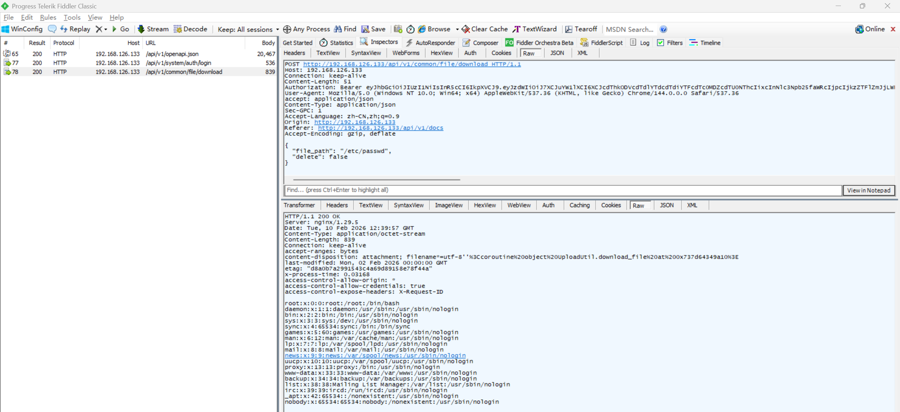

# Unrestricted File Download Vulnerability in FastapiAdmin

> **Software and Affected Version:** [FastapiAdmin](https://github.com/fastapiadmin/FastapiAdmin) ≤ 2.2.0

## Vulnerability Files

-   `/backend/app/api/v1/module_common/file/controller.py`
-   `/backend/app/api/v1/module_common/file/service.py`
-   `/backend/app/utils/upload_util.py`

## Description

An unrestricted file download vulnerability exists in [FastapiAdmin](https://github.com/fastapiadmin/FastapiAdmin) ≤ 2.2.0 at the `/api/v1/common/file/download` endpoint, where the `file_path` field in the request body is used to open and stream files directly without path sanitization or canonicalization. As a result, authenticated attackers with the `module_common:file:download` permission can supply absolute paths or traversal payloads to read sensitive server files (for example, /etc/passwd or private keys), enabling information disclosure and further attacks. Mitigations include enforcing strict path validation and canonicalization, restricting downloads to a safe upload directory or mapping logical IDs to files, disallowing absolute paths and traversal sequences, validating permissions on a per-file basis, and serving files via a controlled safe API or signed, short-lived download tokens.

## Code Analysis

In `/backend/app/api/v1/module_common/file/controller.py`:

```py
@FileRouter.post(
    "/download",
    summary="下载文件",
    description="下载文件",
    dependencies=[Depends(AuthPermission(["module_common:file:download"]))],
)
async def download_controller(
    background_tasks: BackgroundTasks,
    file_path: Annotated[str, Body(description="文件路径")],
    delete: Annotated[bool, Body(description="是否删除文件")] = False,
) -> FileResponse:
    """
    下载文件

    参数:
    - background_tasks (BackgroundTasks): 后台任务对象
    - file_path (str): 文件路径
    - delete (bool): 是否删除文件

    返回:
    - FileResponse: 包含下载文件的响应
    """
    result = await FileService.download_service(file_path=file_path)
    if delete:
        background_tasks.add_task(UploadUtil.delete_file, Path(file_path))
    log.info("下载文件成功")
    return UploadFileResponse(file_path=result.file_path, filename=result.file_name)
```

In `/backend/app/api/v1/module_common/file/service.py`:

```py
class FileService:

    # ...

    @classmethod
    async def download_service(cls, file_path: str) -> DownloadFileSchema:
        """
        下载文件。

        参数:
        - file_path (str): 文件路径。

        返回:
        - DownloadFileSchema: 下载文件响应对象。

        异常:
        - CustomException: 当未选择文件或文件不存在时抛出。
        """
        if not file_path:
            raise CustomException(msg="请选择要下载的文件")
        if not UploadUtil.check_file_exists(file_path):
            raise CustomException(msg="文件不存在")
        file_name = UploadUtil.download_file(file_path)

        return DownloadFileSchema(
            file_path=file_path,
            file_name=str(file_name),
        )
```

In `/backend/app/utils/upload_util.py`:

```py
class UploadUtil:

    # ...

    @staticmethod
    def generate_file(filepath: Path, chunk_size: int = 8192):
        """
        根据文件生成二进制数据迭代器。

        参数:
        - filepath (Path): 文件路径。
        - chunk_size (int): 分块大小，默认 8192 字节。

        返回:
        - Iterator[bytes]: 文件二进制数据分块迭代器。
        """
        with filepath.open("rb") as f:
            while chunk := f.read(chunk_size):
                yield chunk

    # ...

    @classmethod
    async def download_file(cls, file_path: str) -> str:
        """
        下载文件，生成新的文件名。

        参数:
        - file_path (str): 文件路径。

        返回:
        - str: 文件下载信息。
        """
        filename = cls.generate_file(Path(file_path))
        return str(filename)
```

No path validation is performed.

## Proof of Concept

You can read `/etc/passwd` using the following request:


