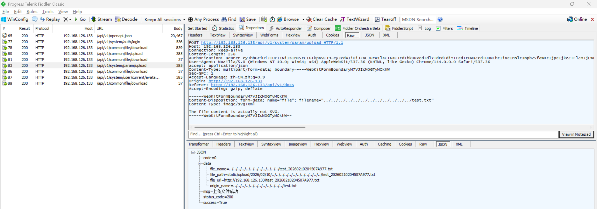
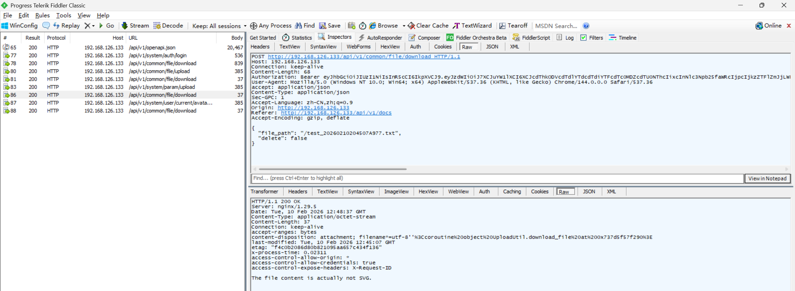

# Unrestricted File Upload Vulnerability Leading to RCE in FastapiAdmin

> **Software and Affected Version:** [FastapiAdmin](https://github.com/fastapiadmin/FastapiAdmin) ≤ 2.2.0

## Affected Files

-   `/backend/app/api/v1/module_system/params/controller.py`
-   `/backend/app/api/v1/module_system/params/service.py`
-   `/backend/app/utils/upload_util.py`

## Description

An unrestricted file upload vulnerability exists in [FastapiAdmin](https://github.com/fastapiadmin/FastapiAdmin) ≤ 2.2.0 at the `/api/v1/common/file/upload` endpoint, where the Content-Type header is trusted to infer allowed extensions, and the file path is not validated or canonicalized. As a result, authenticated attackers with the `module_system:param:upload` permission can bypass extension checks, write arbitrary files to the server filesystem, and, when combined with the scheduled task APIs, achieve remote code execution. Mitigations include enforcing server-side content inspection (validate file magic bytes), deriving extensions from content rather than headers, normalizing and restricting saved paths to a safe upload directory with no execute permissions, generating safe randomized filenames, imposing strict allowlists for upload types, scanning uploads for dangerous content, and requiring least-privilege access controls and audit logging for upload and task APIs.

## Code Analysis

In `/backend/app/api/v1/module_system/params/controller.py`:

```py
@ParamsRouter.post(
    "/upload",
    summary="上传文件",
    dependencies=[Depends(AuthPermission(["module_system:param:upload"]))],
    response_model=ResponseSchema[None],
)
async def upload_file_controller(file: UploadFile, request: Request) -> JSONResponse:
    """
    上传文件

    参数:
    - file (UploadFile): 上传的文件对象
    - request (Request): 请求对象

    返回:
    - JSONResponse: 包含上传文件结果的 JSON 响应
    """
    result_str = await ParamsService.upload_service(base_url=str(request.base_url), file=file)
    log.info(f"上传文件: {result_str}")
    return SuccessResponse(data=result_str, msg="上传文件成功")
```

In `/backend/app/api/v1/module_system/params/service.py`:

```py
class ParamsService:

    # ...

    @classmethod
    async def upload_service(cls, base_url: str, file: UploadFile) -> dict:
        """
        上传文件

        参数:
        - base_url (str): 基础URL
        - file (UploadFile): 上传的文件对象

        返回:
        - dict: 上传文件的响应模型实例字典表示
        """
        filename, filepath, file_url = await UploadUtil.upload_file(file=file, base_url=base_url)

        return UploadResponseSchema(
            file_path=f"{filepath}",
            file_name=filename,
            origin_name=file.filename,
            file_url=f"{file_url}",
        ).model_dump()
```

In `/backend/app/utils/upload_util.py`:

```py
class UploadUtil:

    # ...

    @staticmethod
    def check_file_extension(file: UploadFile) -> bool:
        """
        检查文件后缀是否合法。

        参数:
        - file (UploadFile): 上传的文件对象。

        返回:
        - bool: 文件后缀是否合法。

        异常:
        - CustomException: 文件类型不支持时抛出。
        """
        if file.content_type:
            file_extension = mimetypes.guess_extension(file.content_type)
            if file_extension and file_extension in settings.ALLOWED_EXTENSIONS:
                return True
            raise CustomException(msg="文件类型不支持")
        raise CustomException(msg="文件类型不支持")

    # ...

    @classmethod
    async def upload_file(cls, file: UploadFile, base_url: str) -> tuple[str, Path, str]:
        """
        文件上传。

        参数:
        - file (UploadFile): 上传的文件对象。
        - base_url (str): 基础 URL。

        返回:
        - tuple[str, Path, str]: (文件名, 文件路径, 文件 URL)。

        异常:
        - CustomException: 当文件类型不支持或大小超限时抛出。
        """
        # 文件校验
        if not all([
            cls.check_file_extension(file),
            cls.check_file_size(file),
        ]):
            raise CustomException(msg="文件类型或大小不合法")

        try:
            # 构建完整的目录路径
            dir_path = settings.UPLOAD_FILE_PATH.joinpath(datetime.now().strftime("%Y/%m/%d"))
            dir_path.mkdir(parents=True, exist_ok=True)

            filename = ""
            # 生成文件名并保存
            if file.filename:
                filename = cls.generate_file_name(file.filename)
            filepath = dir_path.joinpath(filename)
            file_url = urljoin(base_url, str(filepath))
            # filepath.mkdir(parents=True, exist_ok=True)

            # 分块写入文件
            chunk_size = 8 * 1024 * 1024  # 8MB chunks
            async with aiofiles.open(filepath, "wb") as f:
                while chunk := await file.read(chunk_size):
                    await f.write(chunk)

            # 返回相对路径
            return filename, filepath, file_url

        except Exception as e:
            log.error(f"文件上传失败: {e}")
            raise CustomException(msg=f"文件上传失败: {e}")
```

The developers did not validate the file path and did not validate the consistency between file content, file extension, and the Content-Type (MIME) header, allowing attackers to bypass `check_file_extension` by spoofing the Content-Type header. It should be noted that this vulnerability and the other two vulnerabilities are based on the same principle, only the entry points differ:

-   [Unrestricted File Upload](https://github.com/CC-T-454455/Vulnerabilities/tree/master/fastapi-admin/vulnerability-3): `/api/v1/common/file/upload`
-   [Unrestricted File Upload](https://github.com/CC-T-454455/Vulnerabilities/tree/master/fastapi-admin/vulnerability-5): `/api/v1/system/user/current/avatar/upload`

## Proof of Concept

Upload a text file disguised as an SVG image using the following request, and remember the returned filename:



Use the [unrestricted file download vulnerability](https://github.com/CC-T-454455/Vulnerabilities/tree/master/fastapi-admin/vulnerability-2) to confirm that the file was successfully uploaded:



For methods to implement RCE combined with scheduled tasks, please refer to [this link](https://github.com/CC-T-454455/Vulnerabilities/tree/master/fastapi-admin/vulnerability-3).
