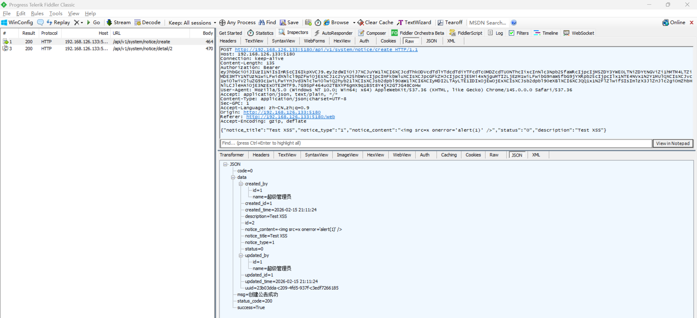

# Markdown-Based XSS Vulnerability in FastapiAdmin

> **Software and Affected Version:** [FastapiAdmin](https://github.com/fastapiadmin/FastapiAdmin) ≤ 2.2.0

## Vulnerability Files

-   `/frontend/src/views/module_system/notice/index.vue`
-   `/frontend/src/components/WangEditor/index.vue`

## Description

A markdown-based Cross-Site Scripting (XSS) vulnerability exists in [FastapiAdmin](https://github.com/fastapiadmin/FastapiAdmin) ≤ 2.2.0 within the system notice functionality, where the `/api/v1/system/notice/create` endpoint accepts user-supplied `notice_content` field without sanitization or validation, stores it directly in the database, and renders it in the frontend using wangEditor (which does not provide built-in XSS protection) without sanitization or validation. As a result, authenticated attackers can inject arbitrary JavaScript that executes in the browsers of users viewing the notice detail, potentially leading to session hijacking, credential theft, or malicious actions performed on behalf of victims. Mitigations include implementing HTML sanitization using libraries like DOMPurify before rendering with wangEditor, using a markdown editor with built-in XSS protection such as mavonEditor, and implementing Content Security Policy (CSP) headers.

## Code Analysis

In `/frontend/src/views/module_system/notice/index.vue`:

```vue
<!-- 公告通知配置 -->
<template>
    <div class="app-container">

        <!-- ... -->

        <!-- 弹窗区域 -->
        <el-dialog
            v-model="dialogVisible.visible"
            :title="dialogVisible.title"
            @close="handleCloseDialog"
        >
            <!-- 详情 -->
            <template v-if="dialogVisible.type === 'detail'">
                <el-descriptions :column="4" border label-width="120px">
                    <el-descriptions-item label="标题" :span="2">
                        {{ detailFormData.notice_title }}
                    </el-descriptions-item>
                    <el-descriptions-item label="类型" :span="2">
                        <el-tag :type="detailFormData.notice_type === '1' ? 'primary' : 'warning'">
                            {{
                                (detailFormData.notice_type
                                    ? (dictStore.getDictLabel("sys_notice_type", detailFormData.notice_type) as any)
                                    : undefined
                                )?.dict_label || detailFormData.notice_type
                            }}
                        </el-tag>
                    </el-descriptions-item>
                    <el-descriptions-item label="状态" :span="2">
                        <el-tag :type="detailFormData.status ? 'success' : 'danger'">
                            {{ detailFormData.status ? "启用" : "停用" }}
                        </el-tag>
                    </el-descriptions-item>
                    <el-descriptions-item label="描述" :span="2">
                        {{ detailFormData.description }}
                    </el-descriptions-item>
                    <el-descriptions-item label="内容" :span="4">
                        <WangEditor v-model="detailFormData.notice_content" :readonly="true" />
                    </el-descriptions-item>
                    <el-descriptions-item label="创建人" :span="2">
                        {{ detailFormData.created_by?.name }}
                    </el-descriptions-item>
                    <el-descriptions-item label="更新人" :span="2">
                        {{ detailFormData.updated_by?.name }}
                    </el-descriptions-item>
                    <el-descriptions-item label="创建时间" :span="2">
                        {{ detailFormData.created_time }}
                    </el-descriptions-item>
                    <el-descriptions-item label="更新时间" :span="2">
                        {{ detailFormData.updated_time }}
                    </el-descriptions-item>
                </el-descriptions>
            </template>
        <!-- ... -->
    </div>
</template>
```

In `/frontend/src/components/WangEditor/index.vue`:

```vue
<template>
    <div style="z-index: 999; border: 1px solid var(--el-border-color)">
        <!-- 工具栏 -->
        <Toolbar
            :editor="editorRef"
            mode="mode"
            :default-config="toolbarConfig"
            style="border-bottom: 1px solid var(--el-border-color)" />
        <!-- 编辑器 -->
        <Editor
            v-model="modelValue"
            :style="{ minHeight: height, overflowY: 'hidden' }"
            :default-config="editorConfig"
            mode="mode"
            @on-created="handleCreated"
            @on-change="handleChange" />
    </div>
</template>
```

The notification content was rendered by [WangEditor](https://github.com/wangeditor-next/wangEditor-next) without any sanitization, and [WangEditor](https://github.com/wangeditor-next/wangEditor-next) does not provide XSS protection.

## Proof of Concept

Create a notice with content `` using the following request:



View notice detail on the client side, causing a pop-up window:


