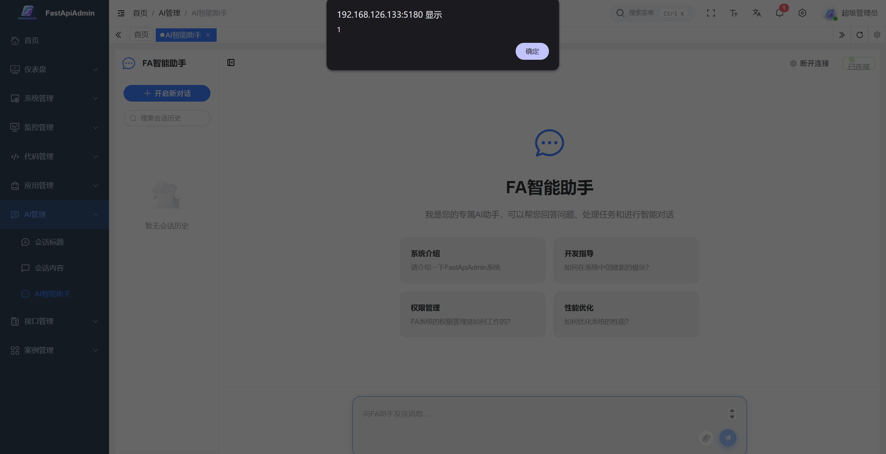
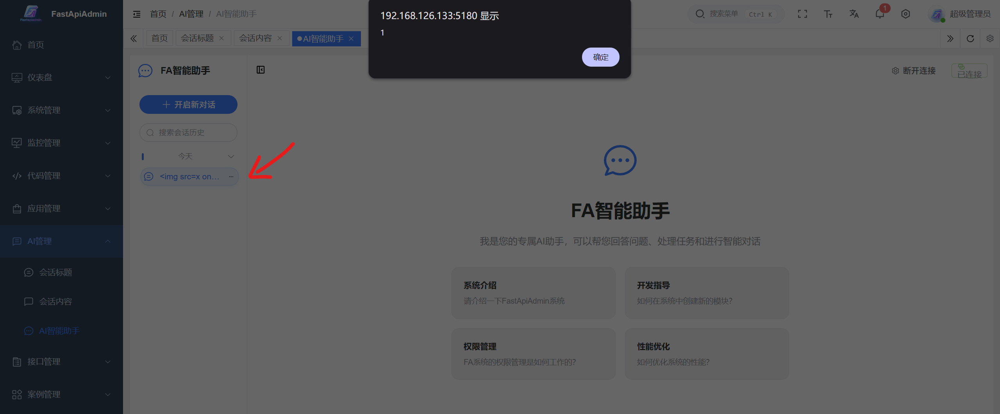
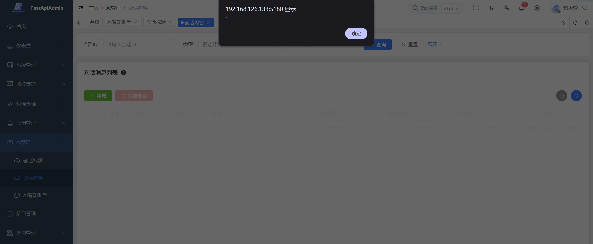

# Markdown-Based XSS Vulnerability in FastapiAdmin

> **Software and Affected Version:** [FastapiAdmin](https://github.com/fastapiadmin/FastapiAdmin) ≤ 2.2.0

## Vulnerability Files

-   `/frontend/src/views/module_ai/chat/components/MessageItem.vue`
-   `/frontend/src/views/module_ai/chat_message/index.vue`
-   `/frontend/src/components/MarkdownRenderer/index.vue`

## Description

A markdown-based Cross-Site Scripting (XSS) vulnerability exists in [FastapiAdmin](https://github.com/fastapiadmin/FastapiAdmin) ≤ 2.2.0 within the AI assistant chat functionality, where user-supplied message content is stored in the database without sanitization or validation, and rendered in the frontend using markdown-it (which does not provide built-in XSS protection) without sanitization or validation. As a result, authenticated attackers can inject arbitrary JavaScript that executes in the browsers of users viewing the chat messages or message management page, potentially leading to session hijacking, credential theft, or malicious actions performed on behalf of victims. Mitigations include implementing HTML sanitization using libraries like DOMPurify before rendering with wangEditor, using a markdown editor with built-in XSS protection such as mavonEditor, and implementing Content Security Policy (CSP) headers.

## Code Analysis

In `/frontend/src/views/module_ai/chat/components/MessageItem.vue`:

```vue
<template>
    <div :class="['message-group', message.type]">
        <!-- ... -->
        <div class="message-content">
            <!-- ... -->
            <div class="message-body">
                <!-- ... -->
                <div class="message-text" :class="{ collapsed: message.collapsed }" v-html="formattedContent"></div>
                <!-- ... -->
            </div>
        </div>
    </div>
</template>

<script setup lang="ts">
// ...

const formattedContent = computed(() => {
    if (!props.message.content) return '';
    return md.render(props.message.content);
});

// ...
</script>
```

In `/frontend/src/views/module_ai/chat_message/index.vue`:

```vue
<!-- AI智能助手消息列表 -->
<template>
    <div class="app-container">
        <!-- ... -->
        <!-- 内容区域 -->
        <el-card class="data-table">
            <!-- ... -->
            <!-- 表格区域：系统配置列表 -->
            <el-table
                ref="tableRef"
                v-loading="loading"
                :data="pageTableData"
                highlight-current-row
                class="data-table__content"
                height="450"
                max-height="450"
                border
                stripe
                @selection-change="handleSelectionChange">
                <!-- ... -->
                <el-table-column
                    v-if="tableColumns.find((col) => col.prop === 'content')?.show"
                    label="内容"
                    prop="content"
                    min-width="300"
                    show-overflow-tooltip>
                    <template #default="scope">
                        <MarkdownRenderer :content="scope.row.content" :max-length="100" />
                    </template>
                </el-table-column>
                <!-- ... -->
            </el-table>
            <!-- ... -->
        </el-card>
        <!-- ... -->
    </div>
</template>
```

In `/frontend/src/components/MarkdownRenderer/index.vue`:

```vue
<template>
    <div class="markdown-content" v-html="renderedContent"></div>
</template>

<script setup lang="ts">
// ...

const renderedContent = computed(() => {
    if (!props.content) return '';
    const content =
        props.maxLength && props.content.length > props.maxLength
            ? props.content.substring(0, props.maxLength) + '...'
            : props.content;
    return md.render(content);
});

// ...
</script>
```

The notification content was rendered by [markdown-it](https://github.com/markdown-it/markdown-it) without any sanitization, and [markdown-it](https://github.com/markdown-it/markdown-it) does not provide XSS protection.

## Proof of Concept

Send a message to the AI ​​assistant with content ``, immediately causing a pop-up window:



Upon re-entering the AI ​​assistant, clicking on a session containing an XSS payload, causing a pop-up window:



Upon entering the message management page, causing a pop-up window without any interaction:


