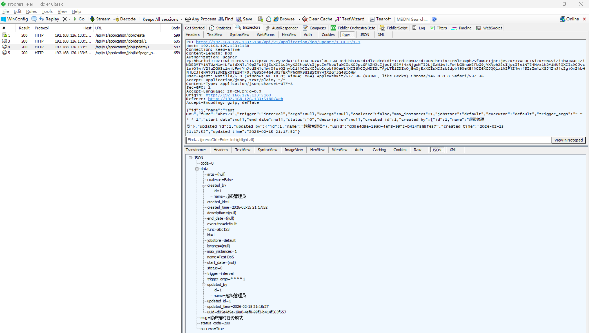
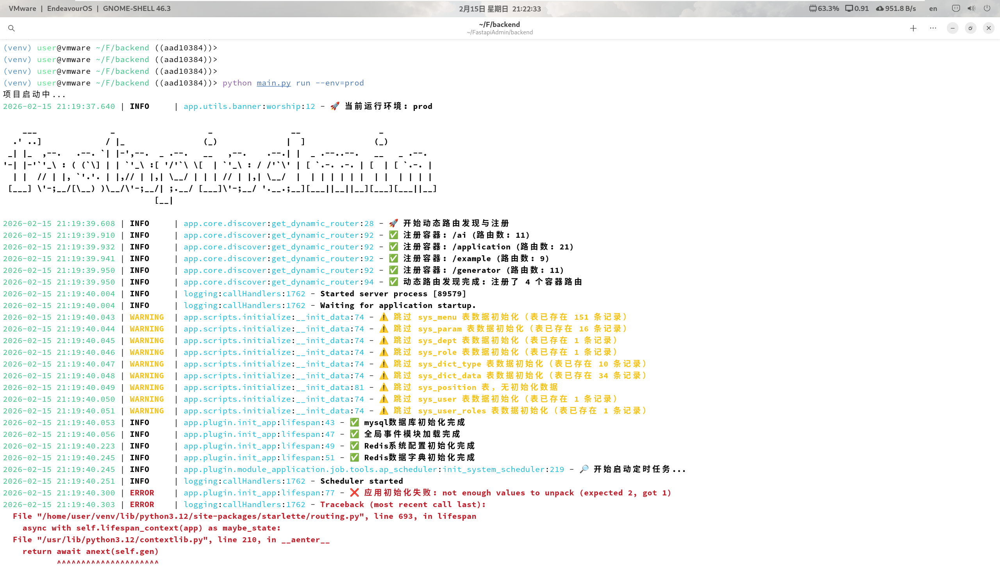
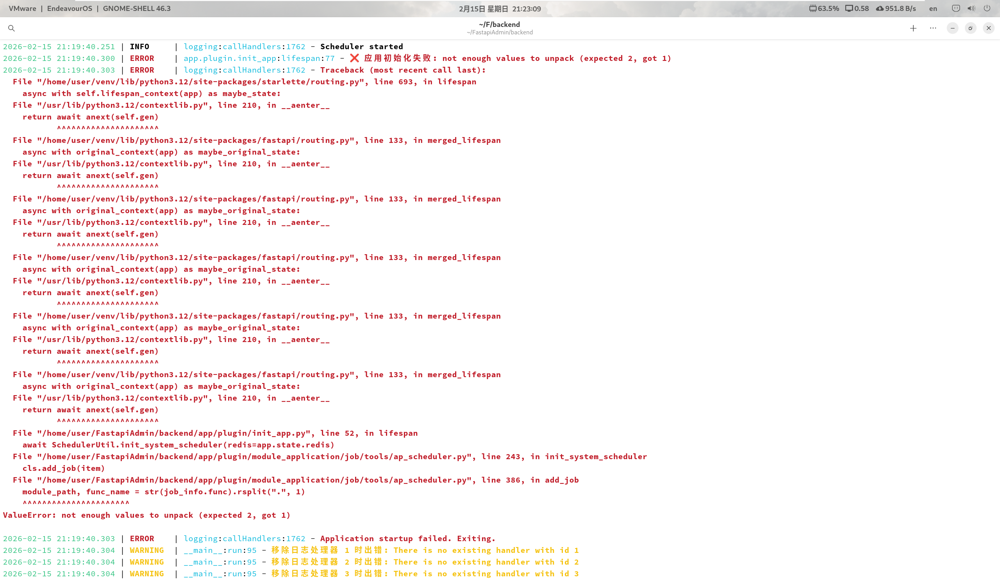

# Uncaught Exception Vulnerability Leading to DoS in FastapiAdmin

> **Software and Affected Version:** [FastapiAdmin](https://github.com/fastapiadmin/FastapiAdmin) ≤ 2.2.0

## Vulnerability Files

-   `/backend/app/plugin/module_task/job/controller.py`
-   `/backend/app/plugin/module_task/job/service.py`
-   `/backend/app/plugin/module_task/job/tools/ap_scheduler.py`

## Description

An uncaught exception vulnerability exists in [FastapiAdmin](https://github.com/fastapiadmin/FastapiAdmin) ≤ 2.2.0 within the `/api/v1/application/job/update/{id}` endpoint, where the `func` field lacks proper validation before being persisted to the database. When the application restarts, the `init_system_scheduler()` method attempts to reload all scheduled tasks and calls `add_job()`, which uses `rsplit(".", 1)` to parse the `func` field into module path and function name. If the `func` field does not contain a dot separator, the `rsplit()` operation fails to unpack into two variables, triggering a `ValueError` that is not caught by the existing exception handlers. This unhandled exception causes the application initialization to fail completely, preventing the server from starting. As a result, authenticated attackers with the `module_task:job:update` permission can cause a Denial of Service (DoS) by manipulating the `func` field of scheduled tasks. Mitigation requires implementing input validation on the `func` field to ensure it contains valid module paths, adding proper exception handling in the task initialization process, and validating task configurations before persisting them to the database.

## Code Analysis

In `/backend/app/plugin/module_application/job/controller.py`:

```py
@JobRouter.put(
    "/update/{id}",
    summary="修改定时任务",
    description="修改定时任务",
    response_model=ResponseSchema[JobOutSchema],
)
async def update_obj_controller(
    data: JobUpdateSchema,
    id: Annotated[int, Path(description="定时任务ID")],
    auth: Annotated[AuthSchema, Depends(AuthPermission(["module_task:job:update"]))],
) -> JSONResponse:
    """
    修改定时任务

    参数:
    - data (JobUpdateSchema): 更新参数模型
    - id (int): 定时任务ID
    - auth (AuthSchema): 认证信息模型

    返回:
    - JSONResponse: 包含修改定时任务结果的JSON响应
    """
    result_dict = await JobService.update_job_service(auth=auth, id=id, data=data)
    log.info(f"修改定时任务成功: {result_dict}")
    return SuccessResponse(data=result_dict, msg="修改定时任务成功")
```

In `/backend/app/plugin/module_application/job/service.py`:

```py
class JobService:

    # ...

    @classmethod
    async def update_job_service(cls, auth: AuthSchema, id: int, data: JobUpdateSchema) -> dict:
        """
        更新定时任务

        参数:
        - auth (AuthSchema): 认证信息模型
        - id (int): 定时任务ID
        - data (JobUpdateSchema): 定时任务更新模型

        返回:
        - dict: 定时任务详情字典
        """
        exist_obj = await JobCRUD(auth).get_obj_by_id_crud(id=id)
        if not exist_obj:
            raise CustomException(msg="更新失败，该定时任务不存在")
        if (
            data.trigger == "cron"
            and data.trigger_args
            and not CronUtil.validate_cron_expression(data.trigger_args)
        ):
            raise CustomException(msg=f"新增定时任务{data.name}失败, Cron表达式不正确")
        obj = await JobCRUD(auth).update_obj_crud(id=id, data=data)
        if not obj:
            raise CustomException(msg="更新失败，该数据定时任务不存在")
        SchedulerUtil().modify_job(job_id=obj.id)
        return JobOutSchema.model_validate(obj).model_dump()
```

In `/backend/app/plugin/module_application/job/tools/ap_scheduler.py`:

```py
class SchedulerUtil:

    # ...

    @classmethod
    async def init_system_scheduler(cls, redis: Redis) -> None:
        """
        应用启动时初始化定时任务。

        返回:
        - None
        """
        # 延迟导入避免循环导入
        from app.api.v1.module_system.auth.schema import AuthSchema
        from app.plugin.module_task.job.crud import JobCRUD

        log.info("🔎 开始启动定时任务...")
        # 保存Redis连接到类变量
        cls.redis_instance = redis
        # 启动调度器
        scheduler.start()
        # 添加事件监听器
        scheduler.add_listener(cls.scheduler_event_listener, EVENT_ALL)
        async with async_db_session() as session:
            async with session.begin():
                auth = AuthSchema(db=session)
                job_list = await JobCRUD(auth).get_obj_list_crud()
                # 使用Redis锁确保只有一个实例执行任务初始化
                redis_client = RedisCURD(redis)
                lock_key = f"{RedisInitKeyConfig.APSCHEDULER_LOCK_KEY.key}:job"
                # 尝试获取锁，过期时间10秒
                lock_acquired, lock_value = await redis_client.lock(lock_key, 10)
                if lock_acquired:
                    try:
                        for item in job_list:
                            # 检查任务是否已经存在
                            existing_job = cls.get_job(job_id=item.id)
                            if existing_job:
                                cls.remove_job(job_id=item.id)  # 删除旧任务
                            # 添加新任务
                            cls.add_job(item)
                            # 根据数据库中保存的状态来设置任务状态
                            if item.status == "1":
                                # 如果任务状态为暂停，则立即暂停刚添加的任务
                                cls.pause_job(job_id=item.id)
                    finally:
                        # 释放锁
                        await redis_client.unlock(lock_key, lock_value)
                else:
                    # 等待其他实例完成初始化
                    import asyncio

                    await asyncio.sleep(2)
                    log.info("✅️ 定时任务已由其他实例初始化完成")

    # ...

    @classmethod
    def add_job(cls, job_info: JobModel) -> Job:
        """
        根据任务配置创建并添加调度任务。

        参数:
        - job_info (JobModel): 任务对象信息（包含触发器、函数、参数等）。

        返回:
        - Job: 新增的任务对象。
        """
        # 动态导入模块
        # 1. 解析调用目标
        module_path, func_name = str(job_info.func).rsplit(".", 1)
        module_path = "app.plugin.module_task.job.function_task." + module_path
        try:
            module = importlib.import_module(module_path)
            job_func = getattr(module, func_name)

            # ...

            log.info(f"任务 {job_info.id} 添加到 {job_info.jobstore} 存储器成功")
            return job
        except ModuleNotFoundError:
            raise ValueError(f"未找到该模块：{module_path}")
        except AttributeError:
            raise ValueError(f"未找到该模块下的方法：{func_name}")
        except Exception as e:
            raise CustomException(msg=f"添加任务失败: {e!s}")

    # ...

    @classmethod
    def modify_job(cls, job_id: str | int) -> Job:
        """
        更新指定任务的配置（运行中的任务下次执行生效）。

        参数:
        - job_id (str | int): 任务ID。

        返回:
        - Job: 更新后的任务对象。

        异常:
        - CustomException: 当任务不存在时抛出。
        """
        query_job = cls.get_job(job_id=str(job_id))
        if not query_job:
            raise CustomException(msg=f"未找到该任务：{job_id}")
        return scheduler.modify_job(job_id=str(job_id))
```

When modifying a task, no validation was performed on the `func` function. During application startup, the exception handling for `rsplit(".", 1)` was not caught during the task addition process.

## Proof of Concept

Create a normal job, with the `func` field being `scheduler_test.job`, and remember the job ID returned:


Modify the above task, changing the `func` field to any value that does not contain the `.` character:



Restarting the server failed due to an uncaught exception:




