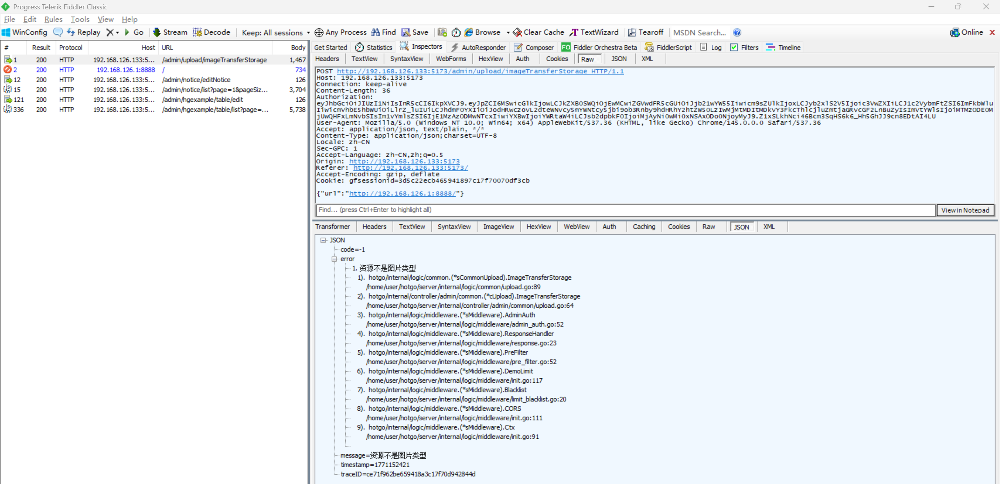
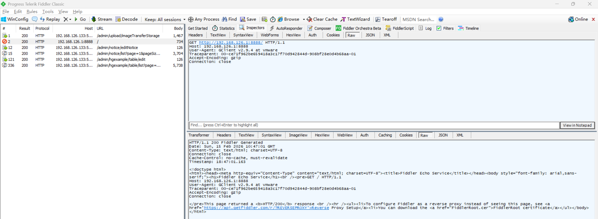

# Server-Side Request Forgery Vulnerability in HotGo

> **Software and Affected Version:** [HotGo](https://github.com/bufanyun/hotgo) ≤ v2.0

## Affected Files

-   `/server/internal/logic/common/upload.go`

## Description

A Server-Side Request Forgery (SSRF) vulnerability exists in [HotGo](https://github.com/bufanyun/hotgo) ≤ v2.0 at the `/admin/upload/imageTransferStorage` endpoint, where user-controlled URLs are directly used to initiate HTTP requests without validation or restriction on the target destination. As a result, authenticated attackers can pass in URLs pointing to internal resources to probe internal network services, access metadata endpoints, bypass firewall restrictions, perform port scanning of internal infrastructure, and potentially exfiltrate sensitive data from services that should not be externally accessible. Mitigations include implementing strict URL validation with allowlists of permitted domains and protocols, blocking requests to private IP ranges, using a dedicated egress proxy with filtering capabilities, implementing network segmentation to isolate the application server from sensitive internal services, and conducting thorough security reviews of all external request functionality.

## Code Analysis

In `/server/internal/logic/common/upload.go`:

```go
// ImageTransferStorage 图片链接转存
func (s *sCommonUpload) ImageTransferStorage(ctx context.Context, in *sysin.ImageTransferStorageInp) (res *sysin.ImageTransferStorageModel, err error) {
	if !gstr.HasPrefix(in.Url, "http://") && !gstr.HasPrefix(in.Url, "https://") {
		return nil, gerror.New("仅支持 HTTP/HTTPS 协议的图片链接")
	}

	resp, err := g.Client().SetTimeout(time.Second*30).Get(ctx, in.Url)
	if err != nil {
		return nil, err
	}
	defer resp.Close()

	if resp.StatusCode != 200 {
		return nil, gerror.Newf("请求图片资源失败, StatusCode:%v", resp.StatusCode)
	}

	contentType := gstr.ToLower(resp.Header.Get("Content-Type"))
	if !gstr.HasPrefix(contentType, "image/") {
		return nil, gerror.New("资源不是图片类型")
	}

	content := resp.ReadAll()
	if len(content) == 0 {
		return nil, gerror.New("图片内容为空")
	}

	res = new(sysin.ImageTransferStorageModel)
	fileHeader, err := file.NewMultipartFileHeader("its-"+grand.Letters(8)+".png", content)
	if err != nil {
		return nil, gerror.Newf("创建文件头失败：%v", err)
	}
	res.AttachmentListModel, err = s.UploadFile(ctx, storager.KindImg, &ghttp.UploadFile{FileHeader: fileHeader})
	return
}
```

The URL is used directly to send the HTTP request without any validation to prevent access to internal network resources.

## Proof of Concept

Requesting `/admin/upload/imageTransferStorage` with an internal network URL (and in addition, the response revealed a stack trace):



The intranet service received a request from the Go server:


