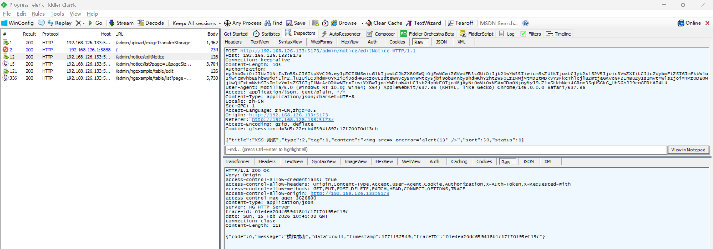
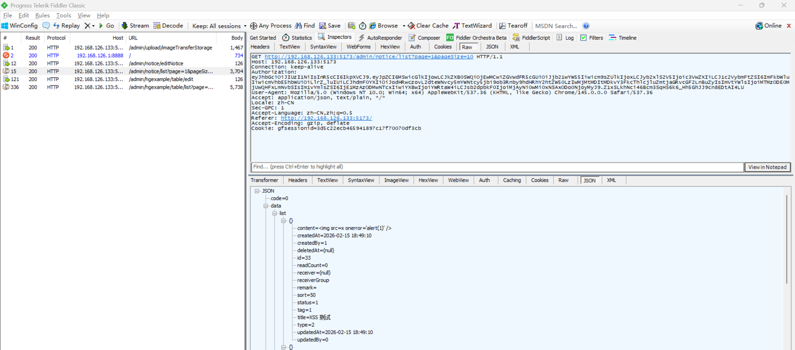
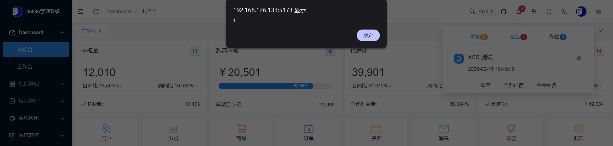

# Stored XSS Vulnerability in HotGo

> **Software and Affected Version:** [HotGo](https://github.com/bufanyun/hotgo) ≤ v2.0

## Affected Files

-   `/web/src/layout/components/Header/MessageList.vue`

## Description

A stored Cross-Site Scripting (XSS) vulnerability exists in [HotGo](https://github.com/bufanyun/hotgo) ≤ v2.0 at the system notice functionality, where the `/admin/notice/editNotice` endpoint accepts user-supplied `content` field without sanitization or validation, stores it directly in the database, and the Vue.js frontend renders this content using `v-html` without sanitization or validation. As a result, authenticated attackers can inject arbitrary JavaScript that executes in the browsers of users viewing the system notice, potentially leading to session hijacking, credential theft, or malicious actions performed on behalf of victims. Mitigations include implementing HTML sanitization using libraries like DOMPurify, avoiding `v-html` in favor of safe Vue.js rendering, implementing Content Security Policy (CSP) headers, encoding output context-appropriately, and validating input against a whitelist of allowed HTML tags and attributes.

## Code Analysis

In `/web/src/layout/components/Header/MessageList.vue`:

```vue
<template>
    <n-scrollbar style="max-height: 360px">
        <n-list>
            <n-list-item v-for="(item, index) in list" :key="item.id" @click="handleRead(index)">
                <n-thing class="px-15px" :class="{ 'opacity-30': item.isRead }">
                    <!-- ... -->
                    <template #description>
                        <div v-if="item.content" class="description-box">
                            <span v-html="item.content" class="description-html"> </span>
                        </div>
                        <p>{{ item.createdAt }}</p>
                    </template>
                </n-thing>
            </n-list-item>
        </n-list>
    </n-scrollbar>
</template>
```

The `v-html` directive is used to render the notice content. According to the [Vue.js documentation](https://vuejs.org/api/built-in-directives#v-html), Vue template syntax will not be processed and the inserted content is not sanitized.

## Proof of Concept

Create a system notice with content `` using the following request:



Confirm that the system notice is successfully created with the XSS payload:



View system notice on the client side, causing a pop-up window:


