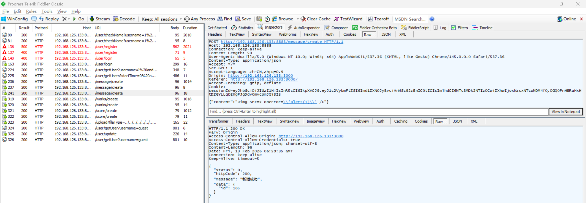
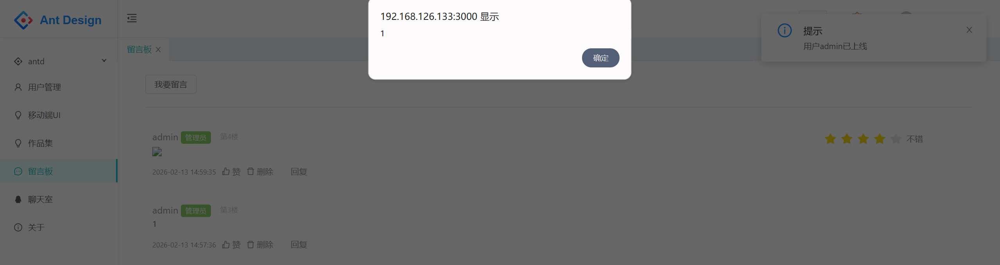

# Stored XSS Vulnerability in Z-9527 Admin

> **Software and Affected Version:** [Z-9527 Admin](https://github.com/z-9527/admin) ≤ commit 72aaf2d

## Affected Files

-   `/server/routes/message.js`
-   `/server/controller/message.js`
-   `/react/src/pages/MessageBoard/index.js`

## Description

A stored Cross-Site Scripting (XSS) vulnerability exists in [Z-9527 Admin](https://github.com/z-9527/admin) ≤ commit 72aaf2d at the message board functionality, where the `/message/create` endpoint accepts user-supplied message content without sanitization or validation, stores it directly in the database, and the React frontend renders this content using `dangerouslySetInnerHTML` without sanitization or validation. As a result, authenticated attackers can inject arbitrary JavaScript that executes in the browsers of users viewing the message board, potentially leading to session hijacking, credential theft, or malicious actions performed on behalf of victims. Mitigations include implementing HTML sanitization using libraries like DOMPurify, avoiding `dangerouslySetInnerHTML` in favor of safe React rendering, implementing Content Security Policy (CSP) headers, encoding output context-appropriately, and validating input against a whitelist of allowed HTML tags and attributes.

## Code Analysis

In `/server/routes/message.js`:

```js
router.post('/create', async function (ctx, next) {
    const sessionId = ctx.cookies.get('sessionId');
    const res = await createMessage(ctx.request.body, sessionId);
    handleRes(ctx, next, res);
});
```

In `/server/controller/message.js`:

```js
const createMessage = async (param, sessionId) => {
    const loginName = jwt.verify(sessionId, TOKEN_SECRETKEY).username;
    const userRes = await getUser({ username: loginName });
    const user = userRes.data || {};

    let insertObj = {
        type: param.type || 0,
        pid: param.pid || -1,
        createTime: Date.now(),
        content: `'${param.content}'` || '',
        userId: user.id,
        userIsAdmin: user.isAdmin,
        userName: `'${user.username}'`,
        userAvatar: `'${user.avatar}'`
    };
    if (param.type === 1) {
        const targetUserRes = await getUser({ id: param.targetUserId });
        const targetUser = targetUserRes.data || {};
        insertObj = {
            ...insertObj,
            targetUserId: targetUser.id,
            targetUserIsAdmin: targetUser.isAdmin,
            targetUserName: `'${targetUser.username}'`,
            targetUserAvatar: `'${targetUser.avatar}'`
        };
    }
    const sql = `insert into messages (${Object.keys(insertObj).join(',')}) values (${Object.values(insertObj).join(
        ','
    )})`;
    const res = await exec(sql);
    if (res.affectedRows) {
        return new SuccessModel({
            data: {
                id: res.insertId
            },
            message: '新增成功'
        });
    } else {
        return new ErrorModel({
            message: '新增失败'
        });
    }
};
```

In `/react/src/pages/MessageBoard/index.js`:

```jsx
<div className="message-list-box">
    {
        Array.isArray(messages) && messages.map((item, index) => (
            <Comment
                key={item.id}
                author={<span style={{ fontSize: 16 }}>{item.userName} {item.userIsAdmin === 1 && <Tag color="#87d068">管理员</Tag>}</span>}
                avatar={}
                content={<div className="info-box braft-output-content" dangerouslySetInnerHTML={createMarkup(item.content)} />}
                actions={this.renderActions(item, item.id)}
                datetime={`第${pagination.total - (pagination.current - 1) * pagination.pageSize - index}楼`}
            >
                {/* ... */}
            </Comment>
        ))
    }
</div>
```

The server did not filter the message content, and the client used `dangerouslySetInnerHTML` to render it directly.

## Proof of Concept

Create a message with content `` using the following request:



The injected code executes on the client side, causing a pop-up window:


