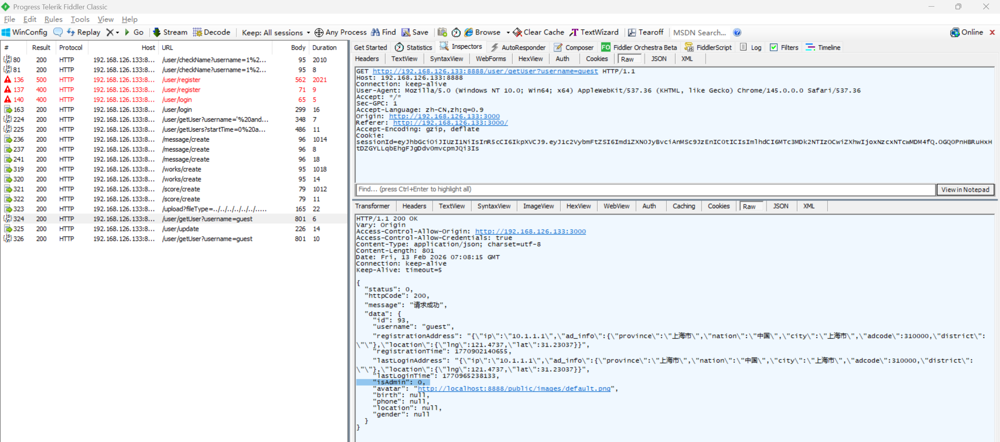
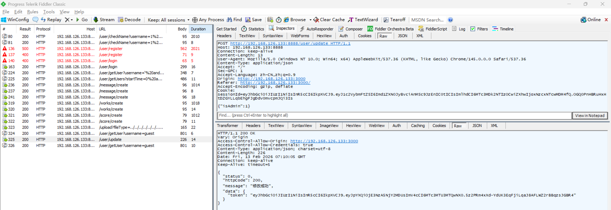

# Mass Assignment Vulnerability in Z-9527 Admin

> **Software and Affected Version:** [Z-9527 Admin](https://github.com/z-9527/admin) ≤ commit 72aaf2d

## Vulnerability Files

-   `server/routes/user.js`
-   `server/controller/user.js`

## Description

A mass assignment vulnerability exists in [Z-9527 Admin](https://github.com/z-9527/admin) ≤ commit 72aaf2d at the `/user/update` endpoint, where user-supplied parameters are directly iterated and incorporated into SQL UPDATE statements without field whitelisting. As a result, authenticated attackers can modify arbitrary database columns, including privilege-escalation fields such as `isAdmin`. Mitigations include implementing a strict whitelist of updatable fields, using an ORM with explicit field mapping, validating all input parameters against allowed attributes, separating privileged fields into admin-only update routes, and applying role-based access control before processing any update operations.

## Code Analysis

In `server/routes/user.js`:

```js
router.post('/update', async function (ctx, next) {
    const sessionId = ctx.cookies.get('sessionId');
    const res = await updateUser(ctx.request.body, sessionId);
    handleRes(ctx, next, res);
});
```

In `server/controller/user.js`:

```js
const updateUser = async (param, sessionId) => {
    const loginName = jwt.verify(sessionId, TOKEN_SECRETKEY).username;
    if (param.username && loginName !== param.username) {
        //如果修改了用户名还要检查用户名是否已经存在
        const checkNameResult = await checkName(param.username);
        if (checkNameResult.data.num) {
            return new ErrorModel({
                message: '用户名已存在',
                httpCode: 400
            });
        }
    }
    let str = '';
    for (let [key, value] of Object.entries(param)) {
        if (value) {
            if (key === 'password') {
                //先解密前端加密的密码
                const originalText = decrypt(value);
                //然后再用另一种方式加密密码
                const ciphertext = genPassword(originalText);
                str += `,${key}='${ciphertext}'`;
            } else {
                str += `,${key}='${value}'`;
            }
        }
    }
    const sql = `update users set ${str.substring(1)} where username='${loginName}'`;
    const res = await exec(sql);
    const res2 = await getUser({ username: param.username });
    if (res2.status === 0) {
        //更新用户的留言（头像、用户名）
        updateUserMessage(res2.data);
    }
    return new SuccessModel({
        data: {
            ...res2.data,
            token: jwt.sign({ username: param.username }, TOKEN_SECRETKEY, { expiresIn: '7d' })
        },
        message: '修改成功'
    });
};
```

This interface does not validate the key names in the param, allowing modification of unexpected fields.

## Proof of Concept

Current user guest is not admin role:



Update the `isAdmin` field with value 1:



Current user guest is admin role now:


