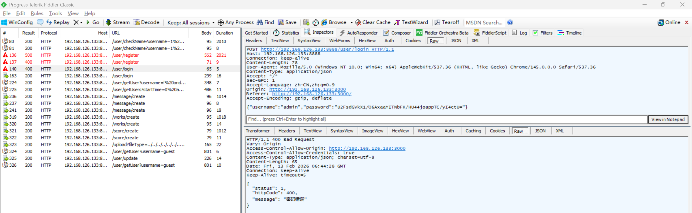
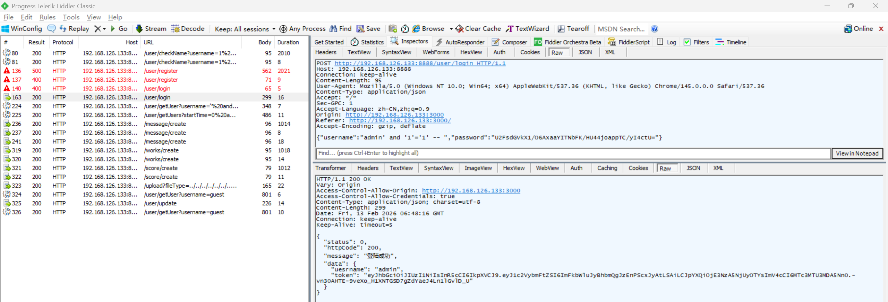

# SQL Injection Vulnerability in Z-9527 Admin

> **Software and Affected Version:** [Z-9527 Admin](https://github.com/z-9527/admin) ≤ commit 72aaf2d

## Vulnerability files

-   `server/routes/user.js`
-   `server/controller/user.js`

## Description

A SQL injection vulnerability exists in [Z-9527 Admin](https://github.com/z-9527/admin) ≤ commit 72aaf2d at the `/user/login` endpoint, where the `username` field in the request body is concatenated directly into a SQL statement without sanitization or parameterization. As a result, unauthenticated attackers can bypass the password check, obtain a valid authentication response (JWT), and immediately assume the targeted account's identity. This can lead to account takeover, data exposure, and potential full system compromise. Mitigations include using parameterized queries or prepared statements instead of string concatenation, enforcing strict server-side input validation and escaping, storing and verifying passwords with strong hashing algorithms (e.g., bcrypt or argon2), applying least-privilege to database accounts, deploying WAF rules to detect common SQLi patterns, and conducting a comprehensive security audit of all database query construction across the codebase.

## Code Analysis

In `server/routes/user.js`:

```js
router.post('/login', async function (ctx, next) {
    const { username, password } = ctx.request.body;
    const res = await login(username, password, ctx);
    handleRes(ctx, next, res);
});
```

In `server/controller/user.js`:

```js
const login = async function (username, password, ctx) {
    const checkNameResult = await checkName(username);
    if (!checkNameResult.data.num) {
        return new ErrorModel({
            message: '用户名不存在',
            httpCode: 400
        });
    }
    //先解密前端加密的密码
    const originalText = decrypt(password);
    //然后再用另一种方式加密密码
    const ciphertext = genPassword(originalText);
    const sql = `select username from users where username='${username}' and password='${ciphertext}'`;
    const res = await exec(sql);
    if (!res.length) {
        return new ErrorModel({
            message: '密码错误',
            httpCode: 400
        });
    }
    const ip = await getIpInfo(ctx);
    if (ip.status !== 0) {
        return new ErrorModel({
            message: '获取IP地址失败',
            httpCode: 500
        });
    }
    const lastLoginAddress = JSON.stringify(ip.data);
    const sql2 = `update users set lastLoginAddress='${lastLoginAddress}',lastLoginTime='${Date.now()}' where username='${username}'`;
    const res2 = await exec(sql2);
    return new SuccessModel({
        message: '登陆成功',
        data: {
            uesrname: res[0].username,
            token: jwt.sign({ username }, TOKEN_SECRETKEY, { expiresIn: '7d' }) //7天过期时间
        }
    });
};
```

The user input is directly concatenated into the SQL statement.

## Proof of Concept

Attempted to log in as admin and received a password error. After changing the username to `admin' and '1'='1' -- ` with the same password, the login was successful.




