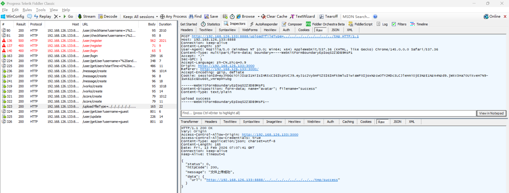
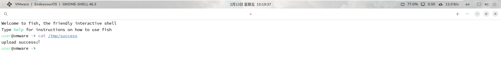

# Unrestricted File Upload Vulnerability in Z-9527 Admin

> **Software and Affected Version:** [Z-9527 Admin](https://github.com/z-9527/admin) ≤ commit 72aaf2d

## Vulnerability Files

-   `/server/routes/index.js`
-   `/server/utils/upload.js`

## Description

An unrestricted file upload vulnerability exists in [Z-9527 Admin](https://github.com/z-9527/admin) ≤ commit 72aaf2d at the `/upload` endpoint, where the `fileType` query parameter is concatenated into the target filesystem path without validation or canonicalization, and the optional `isImg` check can be bypassed. As a result, authenticated attackers can write arbitrary files to the server filesystem. Mitigations include mapping `fileType` to a server-side whitelist of directories, canonicalizing and verifying that resolved paths are inside a fixed upload root, rejecting directory-traversal or absolute-path inputs, generating safe server-side filenames, validating content by magic bytes and size, storing uploads outside the webroot, and running the service with least privilege.

## Code Analysis

In `/server/routes/index.js`:

```js
router.post('/upload', async (ctx, next) => {
    const { isImg, fileType } = ctx.query;
    const serverFilePath = path.join(__dirname, '../public/upload-files');
    const res = await uploadFile(ctx, {
        fileType: fileType || 'myUpload', // common or album
        path: serverFilePath,
        isImg: !!isImg
    });
    handleRes(ctx, next, res);
});
```

In `/server/utils/upload.js`:

```js
function uploadFile(ctx, options) {
    let req = ctx.req;
    let res = ctx.res;
    let busboy = new Busboy({ headers: req.headers });

    // 获取类型
    let fileType = options.fileType || 'common';
    let filePath = path.join(options.path, fileType);
    let mkdirResult = mkdirsSync(filePath); //创建上传文件的目录

    return new Promise((resolve, reject) => {
        console.log('文件上传中...');
        let result = {};

        // 解析请求文件事件
        busboy.on('file', function (fieldname, file, filename, encoding, mimetype) {
            const patt = /\.(jpg|jpeg|png|bmp|BMP|JPG|PNG|JPEG)$/;
            const isPic = patt.test(filename);

            if (options.isImg) {
                if (!isPic) {
                    resolve(
                        new ErrorModel({
                            message: '文件格式非图片类型'
                        })
                    );
                    return;
                }
            }

            let fileName = filename;
            let _uploadFilePath = path.join(filePath, fileName);
            let saveTo = path.join(_uploadFilePath);

            // 文件保存到制定路径
            file.pipe(fs.createWriteStream(saveTo));

            // 文件写入事件结束
            file.on('end', function () {
                result = new SuccessModel({
                    message: '文件上传成功',
                    data: {
                        url: `${ctx.origin}/${fileType}/${fileName}`
                    }
                });
                console.log('文件上传成功！');
            });
        });

        // 解析结束事件
        busboy.on('finish', function () {
            console.log('文件上结束');
            resolve(result);
        });

        // 解析错误事件
        busboy.on('error', function (err) {
            console.log('文件上出错');
            resolve(
                new ErrorModel({
                    message: '文件上传出错'
                })
            );
        });

        req.pipe(busboy);
    });
}
```

By omitting the `isImg` field, the image-only restriction can be bypassed. Although busboy filters filenames, directory traversal is possible by using a `fileType` value that contains `..` pattern.

## Proof of Concept

Upload a file to `/tmp/success` using the following request:



The file was successfully uploaded:


